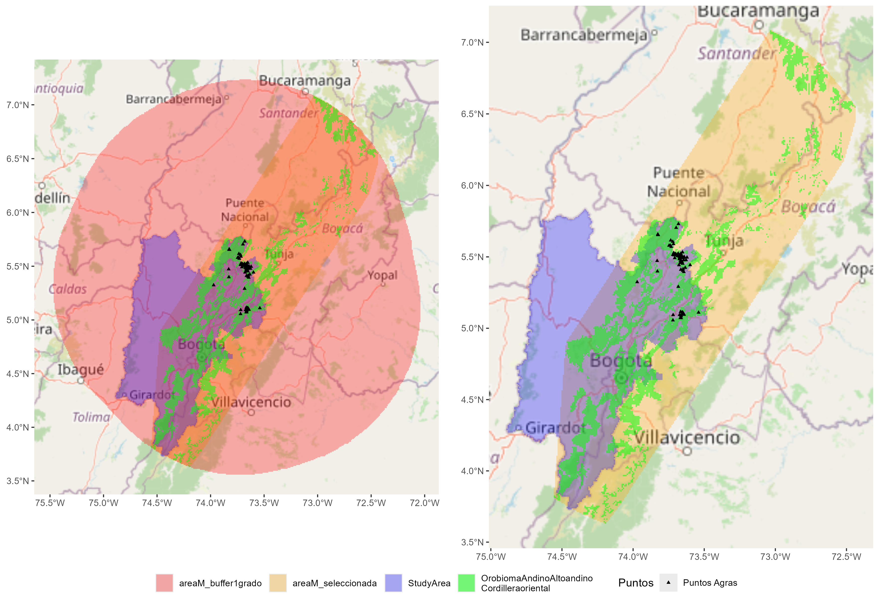

- [1. Organizar entorno de trabajo](#organizar-entorno-de-trabajo)
- [2. Fundamentación del proceso](#fundamentación-del-proceso)
  - [2.1 Definición de Área M.](#definición-de-área-m.)
  - [2.2 Selección de variables](#ID_SeleccionVariables)
  - [2.3 Estimación de modelos](#ID_EstimacionModelos)
  - [2.4 Selección de mejores modelos y mejor
    ensamblaje](#selección-de-mejores-modelos-y-mejor-ensamblaje)
  - [2.5 Análisis de variables](#análisis-de-variables)
  - [2.6 Correspondencia de uso y
    aprovechamiento.](#correspondencia-de-uso-y-aprovechamiento.)
- [Ejecución del proceso](#ejecución-del-proceso)
  - [Definicion de parametros
    generales.](#definicion-de-parametros-generales.)
  - [](#section)
  - [Cargar datos.](#cargar-datos.)
  - [Modelo preliminar – Buffer de 1
    grado.](#modelo-preliminar-buffer-de-1-grado.)
  - [Modelo – Bioma Andino Altoandino de la Cordillera
    Oriental.](#modelo-bioma-andino-altoandino-de-la-cordillera-oriental.)
  - [](#section-1)

Este documento detalla el flujo de trabajo desarrollado en R software
para la estimación del modelo de distribución del agras (Vaccinium
meridionale) en la jurisdicción de la Corporación Autónoma Regional de
Cundinamarca (CAR).

La metodología parte de registros históricos validados por expertos y la
recopilación de variables ambientales como insumo para estimar la
distribución potencial de la especie. Cada etapa del proceso considera
la selección iterativa de variables y modelos más adecuados, utilizando
técnicas de validación cruzada y evaluación de sensibilidad estadística,
sumado a la validación de expertos para seleccionar los parámetros de
calibración de modelos más adecuados. Este enfoque se fundamenta
principalmente en el flujo de trabajo establecido por BioModelos para la
estimación de Modelos de Distribución de Especies, disponible en y
explicada en . No obstante, se realizaron algunas modificaciones para
optimizar la estimación, selección, y ensamblaje del modelo.

Finalmente, se realizó un análisis de correspondencia entre el mapa de
distribución estimado y las dinámicas de uso y aprovechamiento de la
especie por parte de comunidades locales.

## 1. Organizar entorno de trabajo

Siguiendo la metodología propuesta por Biomodelos en
<https://github.com/PEM-Humboldt/biomodelos-sdm>, para la ejecución del
flujo de trabajo para la estimación de modelos de distribución, se debe
disponer del archivo maxent.jar en la máquina de ejecución. Este archivo
debe estar disponible en la ruta del directorio de trabajo o
especificarse durante la ejecución del código la ruta donde está
almacenado. Ejemplos de la organización de las rutas de trabajo se
pueden encontrar en
<https://github.com/PEM-Humboldt/biomodelos-sdm/tree/master/modelling> y
<https://github.com/marlonecobos/kuenm>.

Siguiendo el proceso de organización propuesto por BioModelos, todo el
flujo de trabajo incluyendo tanto este código, como los insumos de
análisis, y resultados se ubican un folder denominado “modelling” sobre
la ruta “~/modelling/Agras”.

``` r
## Cargar librerias necesarias para el análisis ####
# Lista de librerias necesarias
packages_list<-list("magrittr", "dplyr", "plyr", "this.path", "ggplot2", "raster", "terra", "sf", "ggspatial",
                    "maps", "tools", "spThin", "ENMeval","ggdendro", "tibble", "data.table", "pbapply", "openxlsx",
                    "future", "future.apply", "progressr", "performance", "igraph", "tidyr", "ggrepel", "MASS",
                    "pdp", "dismo", "ppcor", "gtools", "ggpubr", "gridExtra", "rlang", "rJava", "rrapply", "snow", "gtools", "pROC"
)

## Revisar e instalar librerias necesarias
packagesPrev<- .packages(all.available = TRUE)
lapply(packages_list, function(x) {   if ( ! x %in% packagesPrev ) { install.packages(x, force=T)}    })

## Cargar librerias
lapply(packages_list, library, character.only = TRUE)
```

``` r
## Establecer directorio de trabajo ####
dir_work<- this.path::this.path() %>% dirname()
```

``` r
print(dir_work)
```

    ## [1] "~/modelling/Agras"

## 2. Fundamentación del proceso

### 2.1 Definición de Área M.

El área de movilidad “Área M” define el rango espacial donde se evalúa
la probabilidad de presencia de la especie. La distribución potencial de
la especie no depende solo de las condiciones dentro del área de
estudio, sino también de las características y barreras históricas y de
dispersión de la especie en zonas adyacentes. Por lo tanto, la
definición del área M debería incluir la región circundante lógica al
área de estudio a modelar.

El área de estudio de esta investigación es el polígono de la
jurisdicción de la CAR ([Figura 1](#ID_fig1)). Por lo que, se utilizó
como área M preliminar un buffer de 111km2 (equivalente a 1grado)
alrededor de un polígono convexo de los registros de la especie en la
jurisdicción de la CAR ([Figura 1](#ID_fig1))

Sin embargo, durante un análisis iterativo preliminar de selección de
variables (ver [Selección de variables](#ID_SeleccionVariables)), se
observó que el área M inicial presentaba una heterogeneidad excesiva
(ver Modelo preliminar – Buffer de 1 grado.). Esta heterogeneidad generó
que los resultados destacaran variables fuertemente asociadas con la
zona andina, debido a la alta frecuencia de registros en esa área con
condiciones homogéneas respecto a la heterogeneidad ambiental que
representaba el resto del Área M. Esto resultó en un sesgo que
sobreestimó la distribución de la especie hacia la zona andina, pero que
no permite identificar patrones de distribución específicos dentro de
ella. Aunque la especie es típica de las zonas altoandinas, esta
situación introduce ruido al no reconocer los patrones diferenciales
dentro de la región, lo cual es crucial para definir con precisión la
distribución de la especie en el área de estudio. Sumado a esto, la alta
heterogeneidad en toda el área M preliminar generó ruido para
identificar patrones de colinealidad y relevancia de las variables
dentro del área de estudio, lo que dificultaba la interpretación y
disminuía la precisión del modelo.

``` r
## Cargar area de estudio
studyArea<- terra::rast(file.path(dir_work, "studyAreaCAR.tif")) %>% setNames("StudyArea")

## Cargar opciones area M ####
areaM_preliminar<-  terra::rast(file.path(dir_work, "areaM_buffer1grado.tif")) %>% setNames("areaM_buffer1grado")
areaM<-  terra::rast(file.path(dir_work, "areaM_convexo_OrobiomaAndinoAltoandinocordilleraoriental.tif")) %>% setNames("AreaM")

## Cargar puntos registros
data_agras<- read.csv(file.path(dir_work, "BDmodelo_CAR.csv"))
data_agras_points <- data_agras %>% st_as_sf(coords = c("decimalLongitude", "decimalLatitude"), crs= 4326) 

## Cargar capa exploratoria bioma
orobiomaAndinoAltoandinocordilleraoriental<- terra::rast(file.path(dir_work, "OrobiomaAndinoAltoandinocordilleraoriental.tif")) %>% setNames("OrobiomaAndinoAltoandinocordilleraoriental")

## plot exploratorio

plot_areaM_preliminar<-  ggplot() +
  annotation_map_tile(zoom = 7) +
  geom_sf(data = st_as_sf(as.polygons(areaM_preliminar)), aes(fill = "red"), alpha = 0.3, color = NA)+
  geom_sf(data = st_as_sf(as.polygons(studyArea)), aes(fill = "blue"), alpha = 0.3, color = NA)+
  geom_sf(data = sf::st_as_sf(terra::as.polygons(orobiomaAndinoAltoandinocordilleraoriental)), aes(fill = "green"), alpha = 0.5, color = NA)+
  scale_fill_identity(name = "", guide = "legend",  labels = c("areaM_buffer1grado", "StudyArea", "OrobiomaAndinoAltoandino\nCordilleraoriental"),breaks = c("red", "blue", "green")) +
    geom_sf(data = data_agras_points, shape = 17, size = 1, aes(color = "Puntos Agras")) +
  scale_color_manual(name = "Puntos", values = "black")
  
plot_areaM<-  ggplot() +
  annotation_map_tile(zoom = 7) +
  geom_sf(data = st_as_sf(as.polygons(areaM)), aes(fill = "red"), alpha = 0.3, color = NA)+
  geom_sf(data = st_as_sf(as.polygons(studyArea)), aes(fill = "blue"), alpha = 0.3, color = NA)+
  geom_sf(data = sf::st_as_sf(terra::as.polygons(orobiomaAndinoAltoandinocordilleraoriental)), aes(fill = "green"), alpha = 0.5, color = NA)+
  scale_fill_identity(name = "", guide = "legend",  labels = c("areaM_seleccionada", "StudyArea", "OrobiomaAndinoAltoandino\nCordilleraoriental"),breaks = c("red", "blue", "green")) +
  geom_sf(data = data_agras_points, shape = 17, size = 1, aes(color = "Puntos Agras")) +
  scale_color_manual(name = "Puntos", values = "black")

plot_areasM<- ggpubr::ggarrange(plotlist = list(plot_areaM_preliminar, plot_areaM), common.legend = T, legend = "bottom")

print(plot_areasM)
```

<a id="ID_fig1"></a>

 Figura 1. Comparación entre el área M
preliminar y el área M seleccionada para el análisis.

Este análisis preliminar resaltó al bioma altoandino de la cordillera
oriental como una variable crucial para la distribución de la especie
(Figura 5). En consecuencia, se decidió ajustar el área M al polígono
convexo alrededor del bioma altoandino de la cordillera oriental que se
superpone con el Área M preliminar ([Figura 1](#ID_fig1)). Este ajuste
permitió una mejor calibración de los modelos a partir de una región
mejor representada para la especie, mejorando así los parámetros de
modelación para estimar su distribución en el área de estudio.

### 2.2 Selección de variables

La selección y calibración de variables es esencial para obtener modelos
predictivos precisos y confiables. Esto permite evitar problemas de
multicolinealidad y reducir el ruido de variables no relevantes sobre el
modelo, maximizando así la utilidad de los datos disponibles y la
robustez de las predicciones realizadas. La multicolinealidad provoca
inestabilidad en los coeficientes de los modelos y dificulta la
interpretación de los efectos individuales de las variables. Mientras
que, las variables no informativas incrementan el ruido al introducir
variabilidad aleatoria en los datos que no aporta información útil para
la predicción del modelo, lo que disminuye su precisión. Para evitar
estos problemas, se realizó una selección iterativa de variables que
consiste en evaluar iterativamente las variables con alta
multicolinealidad y eliminar aquellas poco informativas para los
modelos.

Para el análisis se consideraron 58 variables de resolución de 1km2,
distribuidas de la siguiente manera: 19 variables climáticas obtenidas
de WorldClim (<https://www.worldclim.org/data/bioclim.html>); 25
variables topográficas obtenidas de EarthEnv
(<https://www.earthenv.org/topography>); tres variables vategoricas de
tipo de suelo derivadas del IGAC (<https://www.igac.gov.co/>); una
variable categorica de tipo de bioma, según el IDEAM
(<http://www.ideam.gov.co/web/ecosistemas/mapa-ecosistemas-continentales-costeros-marinos>);
una variable de huella espacial humana a 2022 para Colombia
(<http://geonetwork.humboldt.org.co/geonetwork/srv/spa/catalog.search#/metadata/7d8f0aeb-8136-45a7-a469-f0016f618250>);
y nueve métricas que reflejan la proporción de coberturas naturales en
el paisaje. Estas métricas de coberturas naturales se basan en los datos
del IDEAM 2018
(<http://www.ideam.gov.co/web/ecosistemas/coberturas-nacionales>), y se
evaluaron a diferentes resoluciones espaciales (0.5 km, 4.5 km y 12.5
km), permitiendo un análisis detallado y escalable del entorno natural
del altiplano cundiboyacense. Las variables categoricas se clasificaron
por nivel como variables binarias independientes para obtener mayor
detalle de su influencia durante el análisis. Se reescribieron las
variables a formato .asc para optimizar el análisis.

``` r
## Establecer covariables ####
dir_layers<- file.path(dir_work, "variables_AreaM/Set_1") # folder donde se almacenan todas las covariables
explore_layers <- list.files(dir_layers, recursive = F)
```

``` r
print(explore_layers)
```

    ##  [1] "bioma_BIOMA_IAvH"                                                       
    ##  [2] "CLC_CLC1_CobsNats_rep_apot0.5km.tif"                                    
    ##  [3] "CLC_CLC1_CobsNats_rep_apot12.5km.tif"                                   
    ##  [4] "CLC_CLC1_CobsNats_rep_apot4.5km.tif"                                    
    ##  [5] "CLC_CLC2_Arbustales_rep_apot0.5km.tif"                                  
    ##  [6] "CLC_CLC2_Arbustales_rep_apot12.5km.tif"                                 
    ##  [7] "CLC_CLC2_Arbustales_rep_apot4.5km.tif"                                  
    ##  [8] "CLC_CLC2_Bosques_rep_apot0.5km.tif"                                     
    ##  [9] "CLC_CLC2_Bosques_rep_apot12.5km.tif"                                    
    ## [10] "CLC_CLC2_Bosques_rep_apot4.5km.tif"                                     
    ## [11] "huella2022_IHEH2022.tif"                                                
    ## [12] "suelos_ACIDEZ"                                                          
    ## [13] "suelos_CLIMA"                                                           
    ## [14] "suelos_TEXTURA"                                                         
    ## [15] "topographic_earthenv_Aspect_Cosine.tif"                                 
    ## [16] "topographic_earthenv_Aspect_Eastness.tif"                               
    ## [17] "topographic_earthenv_Aspect_Northness.tif"                              
    ## [18] "topographic_earthenv_Aspect_Sine.tif"                                   
    ## [19] "topographic_earthenv_Count_geomorphological_landforms.tif"              
    ## [20] "topographic_earthenv_Elevation.tif"                                     
    ## [21] "topographic_earthenv_Entropy_geomorphological_landforms.tif"            
    ## [22] "topographic_earthenv_First_order_partial_derivative_E_W_slope.tif"      
    ## [23] "topographic_earthenv_Flat_geomorphological_landform_Percentage.tif"     
    ## [24] "topographic_earthenv_FootSlope_geomorphological_landform_Percentage.tif"
    ## [25] "topographic_earthenv_Hollow_geomorphological_landform_Percentage.tif"   
    ## [26] "topographic_earthenv_Majority_geomorphological_landform.tif"            
    ## [27] "topographic_earthenv_Peak_geomorphological_landform_Percentage.tif"     
    ## [28] "topographic_earthenv_Pit_geomorphological_landform_Percentage.tif"      
    ## [29] "topographic_earthenv_Ridge_geomorphological_landform_Percentage.tif"    
    ## [30] "topographic_earthenv_Roughness.tif"                                     
    ## [31] "topographic_earthenv_Shannon_geomorphological_landforms.tif"            
    ## [32] "topographic_earthenv_Shoulder_geomorphological_landform_Percentage.tif" 
    ## [33] "topographic_earthenv_Slope.tif"                                         
    ## [34] "topographic_earthenv_Slope_geomorphological_landform_Percentage.tif"    
    ## [35] "topographic_earthenv_Spur_geomorphological_landform_Percentage.tif"     
    ## [36] "topographic_earthenv_Terrain_Ruggedness_Index.tif"                      
    ## [37] "topographic_earthenv_Topographic_Position_Index.tif"                    
    ## [38] "topographic_earthenv_Uniformity_geomorphological_landforms.tif"         
    ## [39] "topographic_earthenv_Valley_geomorphological_landform_Percentage.tif"   
    ## [40] "worldclim_bio1_Annual_Mean_Temperature.tif"                             
    ## [41] "worldclim_bio10_BMean_Temperature_of_Warmest_Quarter.tif"               
    ## [42] "worldclim_bio11_Mean_Temperature_of_Coldest_Quarter.tif"                
    ## [43] "worldclim_bio12_Annual_Precipitation.tif"                               
    ## [44] "worldclim_bio13_Precipitation_of_Wettest_Month.tif"                     
    ## [45] "worldclim_bio14_Precipitation_of_Driest_Month.tif"                      
    ## [46] "worldclim_bio15_Precipitation_Seasonality.tif"                          
    ## [47] "worldclim_bio16_Precipitation_of_Wettest_Quarter.tif"                   
    ## [48] "worldclim_bio17_Precipitation_of_Driest_Quarter.tif"                    
    ## [49] "worldclim_bio18_Precipitation_of_Warmest_Quarter.tif"                   
    ## [50] "worldclim_bio19_Precipitation_of_Coldest_Quarter.tif"                   
    ## [51] "worldclim_bio2_Mean_Diurnal_Range.tif"                                  
    ## [52] "worldclim_bio3_Isothermality.tif"                                       
    ## [53] "worldclim_bio4_Temperature_Seasonality.tif"                             
    ## [54] "worldclim_bio5_Max_Temperature_of_Warmest_Month.tif"                    
    ## [55] "worldclim_bio6_Min_Temperature_of_Coldest_Month.tif"                    
    ## [56] "worldclim_bio7_Temperature_Annual_Range.tif"                            
    ## [57] "worldclim_bio8_Mean_Temperature_of_Wettest_Quarter.tif"                 
    ## [58] "worldclim_bio9_Mean_Temperature_of_Driest_Quarter.tif"

``` r
## Cargar variables ####

env_layers<- list.files( dir_layers, "\\.asc$|\\.tif$", recursive = T, full.names = T)
stac_layers<- terra::rast(env_layers) %>% terra::mask(areaM) 
names(stac_layers)<-  gsub(",", ".", names(stac_layers)); names(stac_layers)<-  gsub("-", "",  names(stac_layers))

# remover covariables que no dan informacion en el area de estudio
stac_names<- terra::freq(stac_layers) %>% dplyr::filter(!is.na(value)) %>% dplyr::filter(!value==0) %>% {names(stac_layers)[unique(.$layer)]}
envMstack<- stac_layers[[stac_names]]

# reescribir covariables para optimizar el analisis
folder_vars_areaM<- file.path(dir_work, "variables_AreaM_adjust/Set_1") # folder donde se reescriben

dir.create(folder_vars_areaM, showWarnings = F, recursive = T)
files_envM<- list.files( folder_vars_areaM, "\\.asc$", recursive = T, full.names = F) %>% tools::file_path_sans_ext()

ndec<- function(x) {dec <- nchar(strsplit(as.character(x), "\\.")[[1]][2]);
  if (is.na(dec)) dec <- 0
  return(as.numeric(dec))
}

for (i in 1:nlyr(envMstack)) {  name_layer<- names(envMstack)[i] ;
if(!(name_layer %in% files_envM)){
  
  envMi <- envMstack[[i]]
  
    value <- values(envMi, na.rm = TRUE) %>% max()
    y <- ndec(x = value)
    
    if (y == 0) { datTyp <- "INT2S"; decinum <- 0 }
    if (y >= 1) { datTyp <- "FLT4S"; decinum <- 3 }
    
    writeRaster(x = if(is.factor(envMi)){envMi}else{round(envMi, digits = decinum)},
                filename = file.path(folder_vars_areaM, paste0( names(envMstack[[i]]), ".asc")), overwrite = T, NAflag = -9999, datatype = datTyp)
  }   }

env.Mfiles <- list.files(folder_vars_areaM, ".asc$", recursive = T, full.names = T)
env.M <- terra::rast(env.Mfiles)[[stac_names]]
```

``` r
print(env.M)
```

    ## class       : SpatRaster 
    ## dimensions  : 409, 382, 68  (nrow, ncol, nlyr)
    ## resolution  : 0.008992953, 0.008992953  (x, y)
    ## extent      : -75.475, -72.03969, 3.558318, 7.236435  (xmin, xmax, ymin, ymax)
    ## coord. ref. : lon/lat WGS 84 
    ## sources     : bioma_BIOMA_IAvH_OrobiomaAndinoAltoandinocordilleraoriental.asc  
    ##               bioma_BIOMA_IAvH_OrobiomaAzonalAndinoAltoandinocordilleraoriental.asc  
    ##               CLC_CLC1_CobsNats_rep_apot0.5km.asc  
    ##               ... and 65 more source(s)
    ## names       : bioma~ental, bioma~ental, CLC_C~0.5km, CLC_C~2.5km, CLC_C~4.5km, CLC_C~0.5km, ... 
    ## min values  :           0,           0,           0,       0.068,       0.004,           0, ... 
    ## max values  :           1,           1,           1,       0.981,       0.999,           1, ...

La primera etapa incluyó la evaluación de la multicolinealidad de las
variables. Para esto, se estimaron matrices de correlación de Spearman
entre todas las variables consideradas. Luego, se efectuó un análisis de
conglomerados jerárquicos para agrupar las variables con una correlación
mayor a 0.65 (Figura 6). De cada grupo correlacionado se seleccionó la
variable que presentaba el menor factor de Inflación de la Varianza
(VIF). No obstante, se generó una lista de variables que, debido a su
importancia ecológica, siempre debían mantenerse como primeras de grupo,
a pesar de tener un VIF mayor que las demás. Este proceso se realizó
iterativamente hasta que no se presentó colinealidad alguna entre las
variables (Figura 6).

``` r
# umbral de correlacion para pruebas de multicolinealidad 
cor_threshold<- 0.65

# variables que deben mantenerse en pruebas de multicolinealidad
vars_predilection<-  c("topographic_earthenv_Elevation", "worldclim_bio12_Annual_Precipitation", "CLC_CLC2_Arbustales_rep_apot0.5km") %>% 
  {data.frame(Var= ., sort_pred=  seq_along(.))}
```

Durante la segunda etapa, con las variables no colineales, se estimó la
importancia de las variables para la estimación de múltiples modelos de
distribución Maxent mediante pruebas de validación cruzada (ver
[Estimación de modelos](#ID_EstimacionModelos)). La importancia de las
variables se evaluó entre todos los modelos generados, calculando la
media de la contribución porcentual y la importancia por permutación de
cada variable (Figura 7). La contribución porcentual indica la
proporción en que cada variable explica la variación en los datos de
presencia de la especie en el modelo, mientras que la importancia por
permutación mide cuánto disminuye la precisión del modelo cuando los
valores de una variable se permutan aleatoriamente (ver Análisis de
variables).

Se eliminaron iterativamente las variables con una importancia por
permutación inferior al 1%. Este proceso iterativo continuó hasta que
todas las variables en el modelo alcanzaron un nivel de importancia del
1%, asegurando así la selección de un conjunto optimizado de variables
para la calibración del modelo (Figura 7).

### 2.3 Estimación de modelos

La selección y calibración de modelos predictivos es un proceso crucial
para asegurar resultados precisos y confiables sobre la distribución de
la especie. La calibración comienza con la definición de los parámetros
de ajuste y la preparación de datos de evaluación, que incluye sitios
con la presencia confirmada de la especie y sitios de fondo que
representan áreas de ausencia o no muestreadas. Este conjunto de datos
se utiliza para que el modelo capture y estime estadísticamente la
relación entre las variables ambientales y la distribución de la
especie. Como datos de ocurrencia se utilizaron los registros validados
por expertos, mientras que como datos de fondo se usaron 10000 puntos
aleatorios alrededor del área M 10,000 que cubrieran toda la
heterogeneidad ambiental de la zona ([Figura 4](#ID_fig4)).

``` r
# Organizacion de registros ####

# numero de datos aleatorios - pseudo ausencias
Max.Bg<- 10000

## Crear grilla base de analisis
raster_base<- terra::rast(areaM)
raster_ids<- raster_base %>%  terra::setValues(seq(ncell(.)))

## Espacializacion de datos y eliminacion de duplicados ####
data_agras_centroids<- data_agras_points %>%
  {dplyr::mutate(., id= terra::extract(raster_ids, .)[,2])} %>% dplyr::select(c("id")) %>% 
  dplyr::filter(!duplicated(id)) %>% st_drop_geometry() %>% cbind(terra::xyFromCell(raster_base, .$id))

raster_occurrences<- raster_base; raster_occurrences[data_agras_centroids$id]<- 1

data_occs<- terra::cells(raster_occurrences) %>% {cbind(terra::xyFromCell(raster_occurrences, .), env.M[.])} %>% 
  as.data.frame() %>%  dplyr::rename("longitude"="x", "latitude"="y") %>% na.omit()

## Generacion de datos de entrenamiento y evaluacion ####
sp_occs<- data_occs %>% st_as_sf(coords = c("longitude", "latitude")) %>% {terra::extract(raster_ids, .)[,2]}

# definir bg - background data - pseduo ausencias 
ids_background<- cells(areaM) %>% {.[!. %in% sp_occs ]}
sample_background<- sample(x = ids_background, size = Max.Bg, replace = F)
data_Sbg<- env.M
Sbg <- cbind(terra::xyFromCell(env.M, sample_background), env.M[sample_background]) %>% as.data.frame() %>% 
  dplyr::rename("longitude"="x", "latitude"="y") %>% na.omit()
```

Figura 2. Puntos usados para el modelo

Se estimaron modelos Maxent que predicen la distribución potencial de
una especie como la distribución de probabilidad mas uniforme o de
máxima entropía en función de variables ambientales. Sin embargo, la
complejidad de estos modelos es altamente sensible a parámetros de
ajuste y calibración para su estimación.

La evaluación y ajuste de estos parámetros permiten capturar la
complejidad y variabilidad inherente a la distribución de la especie.
Estos parámetros incluyen las funciones características de modelado (fc)
y el factor de regularización multiplicativa (rm). Las funciones
características de modelado determinan la relación matemática entre las
variables ambientales y la presencia de la especie, que puede estimarse
desde relación lineal (L), cuadrática (Q), de producto (P), de umbral
(T) y de bisagra (H). Mientras que, el factor de regularización
multiplicativa controla la complejidad del modelo penalizando relaciones
demasiado complejas entre variables para evitar el sobreajuste. Valores
más altos de rm simplifican el modelo, mientras que valores más bajos
permiten capturar relaciones más detalladas, buscando un balance entre
la precisión del modelo y su capacidad de generalización.

Para esta investigación, se configuraron los parámetros de calibración
de modelos utilizando todas las posibles combinaciones de funciones
características (fc) junto con valores multiplicativos de regularización
(rm) que varían de 0.5 a 6 en incrementos de 0.5. Esto generó un total
de 360 combinaciones de modelos calibrados, permitiendo explorar un
amplio rango de opciones para identificar el mejor modelo predictivo
posible para la distribución de la especie (Tabla 1).

Durante la selección iterativa y la evaluación de la importancia de las
variables, estos modelos se estimaron utilizando el método de
particionamiento “block” para la optimización computacional. Sin
embargo, una vez identificadas las mejores variables de calibración, se
empleó el método de particionamiento “jackknife” para la validación de
resultados (Tabla 2). El método “jackknife” es una técnica robusta de
validación cruzada que consiste en excluir sistemáticamente cada
localidad de ocurrencia del conjunto de datos, entrenar el modelo con
las localidades restantes y luego evaluar el modelo excluyendo dicha
localidad. Este enfoque permite obtener métricas sólidas sobre la
confiabilidad y el poder predictivo de los modelos, como AUC y AICc, que
reflejan la capacidad del modelo para generalizar y predecir la
distribución de la especie (ver Selección de mejores modelos).

La salida de cada modelo es la predicción de la ocurrencia de la especie
en el área de estudio, expresada en rangos de probabilidad de 0 a 1. Se
consideraron como presencias de la especie aquellos sitios que mostraban
una probabilidad de ocurrencia superior a un umbral definido, que en
esta investigación se estableció en 0.75.

### 2.4 Selección de mejores modelos y mejor ensamblaje

En la modelización de la distribución de especies, es común que los
modelos predictivos individuales muestren métricas de rendimiento con
poca variabilidad, lo que sugiere que todos los modelos son buenos a
pesar de hacer predicciones diferentes. Frente a la dificultad de
seleccionar un mejor modelo sin perder información relevante que otros
modelos puedan mostrar, ensamblar modelos puede ser más efectivo.
Ensamblar modelos implica combinar las predicciones de múltiples modelos
para obtener una estimación más robusta y precisa de la tendencia de
predicción, aprovechando las fortalezas comunes entre modelos y
reduciendo la influencia de predicciones atípicas.

Ensamblar los mejores modelos garantiza que las predicciones sean
coherentes y precisas, y se minimiza el riesgo de que modelos de baja
calidad distorsionen los resultados finales. Para determinar cuáles son
los mejores modelos, se utilizaron tanto el rendimiento estadístico como
el conocimiento experto. El rendimiento de los modelos se evaluó
utilizando el AICc derivado de la estimación “jackknife”, que representa
la calidad del ajuste del modelo penalizado por su complejidad. Como
conocimiento experto, se estimó la similitud entre cada modelo y un mapa
de expertos con restricciones e inclusiones de lugares con conocimiento
de presencia o ausencia de la especie. Esto permite evaluar qué modelos
estadísticos son más similares al conocimiento experto y, en ese
sentido, aquellos que mejor justifican estadísticamente la información
de expertos ([Figura 3](#ID_fig3))

Figura 3. Mapa de expertos.

Para determinar los mejores modelos, tanto desde su rendimiento
estadístico como su similitud con el mapa de expertos, en cada modelo se
extrajo como área de alta probabilidad de ocurrencia de la especie
aquellas zonas con predicción superior al umbral (≥0.75) y se calculó la
puntuación del modelo utilizando la siguiente ecuación:

Esta ecuación penaliza los modelos con alta coincidencia con zonas de
restricción, mientras que da más puntaje a aquellos que coinciden con
zonas de inclusión del mapa de expertos. De esta manera, los AICc de
rendimiento del modelo se ajustan considerando tanto las áreas de
restricción como las de inclusión según el conocimiento experto.

Con esta puntuación, se clasificaron los modelos del mejor al peor
desempeño, siendo mejores aquellos con un score bajo. Un AICc bajo es
deseable porque indica que el modelo ofrece un buen ajuste a los datos
sin ser excesivamente complejo. Un valor bajo de AICc sugiere que el
modelo es eficiente en términos de información y evita el sobreajuste,
logrando un equilibrio óptimo entre precisión y parsimonia.

Después de clasificar los modelos, se ensamblaron de forma incremental
para evaluar su rendimiento combinado. El ensamble se estimó como la
media lineal de predicción entre los modelos. Se comenzó combinando el
mejor modelo con el segundo mejor, y luego se añadió el tercer mejor, y
así sucesivamente hasta incluir todos los modelos. En cada etapa, se
recalculó la puntuación del modelo utilizando la ecuación descrita.

Se seleccionó como mejor ensamblaje aquel con el mejor (menor) score
recalculado, considerando esta combinación de modelos como la que mejor
predice la distribución de la especie. De manera que representa la
estimación más robusta y confiable de la distribución de la especie,
integrando tanto la precisión estadística como el conocimiento experto.

### 2.5 Análisis de variables

Analizar los modelos resultantes y los factores que los direccionan
desde una perspectiva ecológica es esencial para la toma de decisiones
informadas en conservación y manejo de la biodiversidad. Este enfoque
permite entender el comportamiento de las variables utilizadas para
predecir la distribución de la especie y proporciona una base lógica
para interpretar los resultados del modelo. El análisis de variables en
esta investigación comenzó con la selección iterativa de variables
relevantes para la calibración de modelos a partir de su análisis de
importancia y no colinealidad.

El análisis de multicolinealidad consistió en extraer variables
colineales, es decir, aquellas que se comportan de manera similar, para
evitar el sobreajuste del modelo. Extraer variables colineales no
significa desconocer su importancia para la predicción del modelo, sino
que permite agrupar variables que se comportan de manera similar, para
evitar dobles conteos que sesguen los resultados. No obstante, para
facilitar la interpretación del modelo resultante, se reestimó la
colinealidad de las variables, no entre ellas mismas como en la
selección iterativa, sino en términos de su similitud para predecir el
modelo (Figura 8). Esto permite identificar variables que contribuyen de
manera similar a la predicción de la distribución sin llevar a un
sobreajuste, pero facilitando la interpretación ecológica del modelo.

Por otro lado, el análisis de importancia por permutación superior al 1%
permitió identificar aquellas variables que realmente aportan de manera
significativa al modelo. La importancia por permutación mide cuánto
disminuye la precisión del modelo cuando los valores de una variable se
permutan aleatoriamente. Este método implica reordenar aleatoriamente
los valores de una variable y evaluar el impacto de esta permutación en
el desempeño del modelo. Si una variable es relevante para el modelo, su
permutación debería causar una disminución significativa en la precisión
del modelo. Por el contrario, si la permutación de una variable no
cambia considerablemente el desempeño del modelo, esa variable es menos
relevante para las predicciones del modelo.

La selección iterativa de variables permitió identificar las variables
importantes en promedio para todos los modelos evaluados, determinando
así cuáles son relevantes para la distribución de la especie. Este
proceso se replicó con el mejor modelo ensamblado, obteniendo la
importancia media de las variables para los mejores modelos (Figura 9).

Para entender con mayor nivel de detalle el comportamiento de las
variables en la predicción de los modelos, se realizaron análisis de
dependencia parcial. Estos análisis permiten observar cómo cambia la
predicción del modelo cuando varían los atributos de cada variable,
manteniendo constantes las demás variables. De esta manera, se puede
identificar la relación directa entre un atributo y la probabilidad de
presencia de la especie. Además, este enfoque permite interpretar la
interacción entre varias variables cuando las demás se mantienen
constantes. Para esta investigación, se realizaron análisis de
dependencia parcial individuales y por pares de las variables
seleccionadas como relevantes a partir de cada modelo construido (Figura
10). Dentro de cada modelo, se realizó el análisis de dependencia
parcial, y para el modelo ensamblado se promediaron los resultados de
dependencia parcial por atributo y variable de los modelos que lo
integran (Figura 10).

### 2.6 Correspondencia de uso y aprovechamiento.

La última parte del flujo de trabajo analizo la relación de
correspondencia entre las predicciones del modelo y dinámicas de uso y
aprovechamiento de la especie. Para ello, se sobrepusieron las áreas de
alta probabilidad de ocurrencia de la especie (\>= 0.75) con zonas que
contaban con datos de uso y aprovechamiento. Cada una de estas zonas
contaba con una puntuación ponderada de índice de uso de
aprovechamiento, la cual se contrastó con la representatividad de la
especie en la zona, definida como el área de la zona donde está presente
la especie con alta probabilidad.

Con esta información se generaron figuras de influencia – dependencia
que representan la relación entre el aprovechamiento y la
representatividad de la especie por sitio. La ubicación de los sitios en
los cuadrantes de la figura representa:

Cuadrante I: Alta representatividad y alto uso. Estas áreas son críticas
tanto para la conservación como para el aprovechamiento sostenible de la
especie.

Cuadrante II: Baja representatividad y alto uso. Áreas con alta presión
de uso, pero donde la especie no está tan representada.

Cuadrante III: Baja representatividad y bajo uso. Áreas con menor
prioridad tanto para conservación como para uso.

Cuadrante IV: Alta representatividad y bajo uso. Áreas importantes para
la conservación donde la presión de uso es baja.

Este enfoque facilita la identificación de zonas prioritarias para la
conservación y el manejo sostenible de la especie, integrando tanto
aspectos ecológicos como socioeconómicos en la toma de decisiones. Esta
metodología proporciona una herramienta visual y analítica potente para
gestionar de manera más efectiva las áreas de conservación y uso
sostenible, asegurando que las decisiones tomadas se basen en una
comprensión integral de las dinámicas ecológicas y de uso y
aprovechamiento.

## Ejecución del proceso

### Definicion de parametros generales.

Tabla 1. Combinaciones de modelos evalaudas

### 

### Cargar datos.

Figura 4. Puntos usados para el modelo

### Modelo preliminar – Buffer de 1 grado.

Figura 5. Importancia de variables buffer 1 grado

### Modelo – Bioma Andino Altoandino de la Cordillera Oriental.

Figura 6. Dendograma de correlación. Variables en rojo fueron
seleccionadas, y en negro evitadas.

Figura 7. Importancia de variables areA M final

Tabla 2. Resultados de los modeloss

### 

Figura 8. Dendograma de correlación de predicciones modelo ensamblado

Figura 9. Importancia de variables modelo ensamblado final

Figura 10. Resultados dependencia parcial

Figura 11. Diagrama de influencia dependencia del modelor especto al uso
