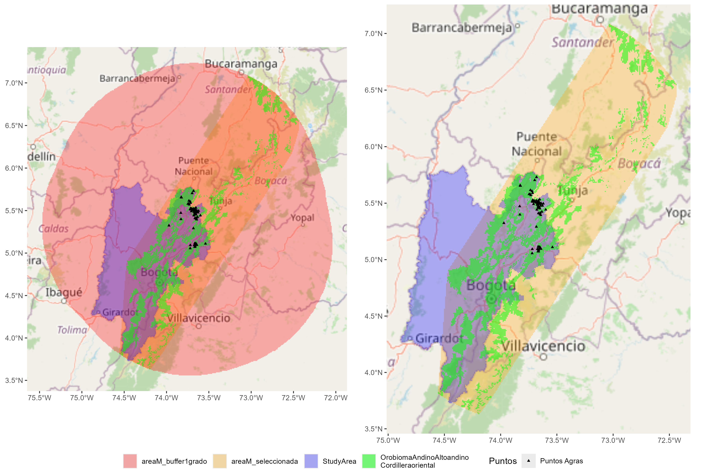
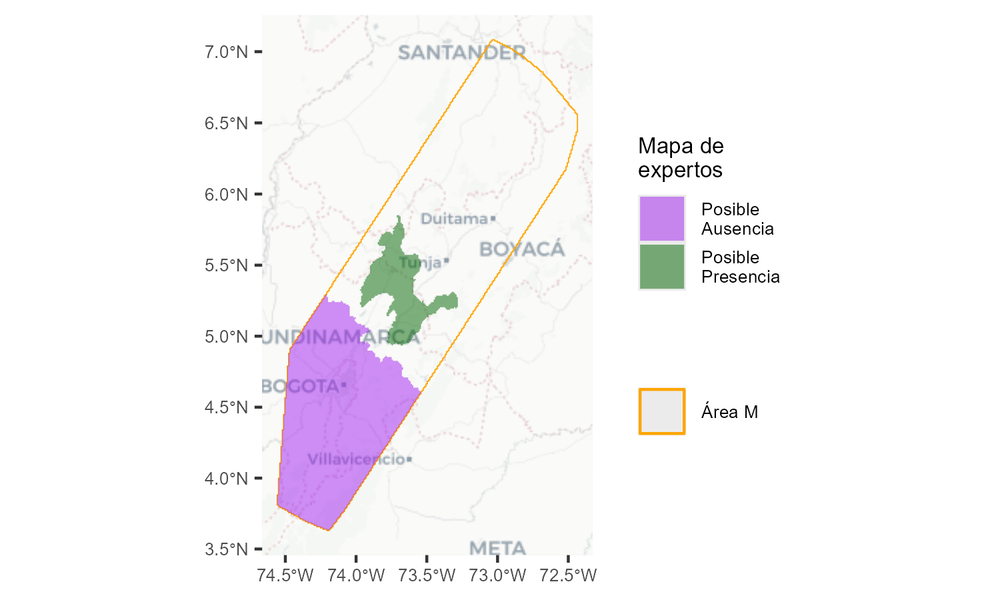
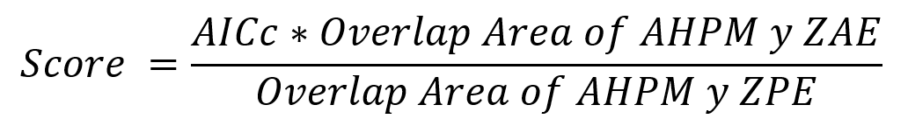
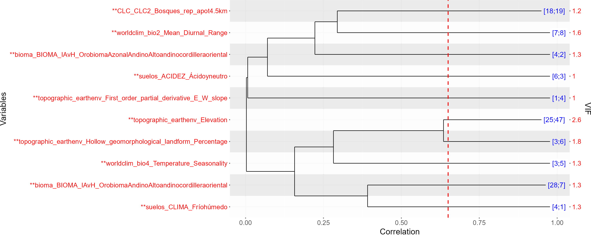
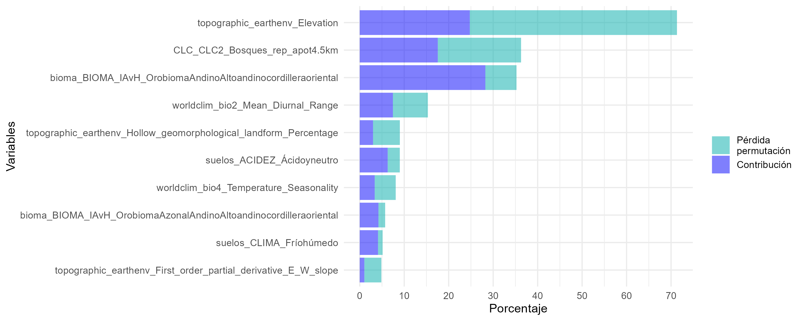
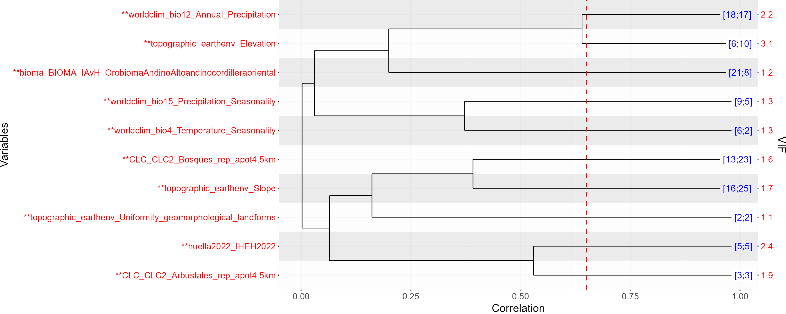
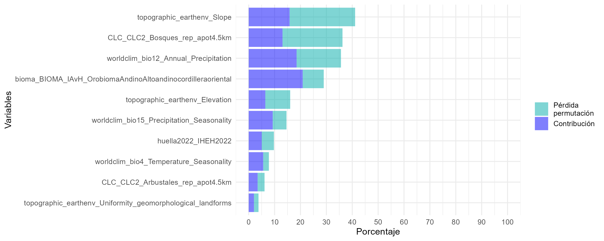

Flujo de trabajo – Modelo de distribución de Vaccinium meridionale en el
altiplano cundiboyacense, Colombia
================

Este documento detalla el flujo de trabajo desarrollado en R software
para la estimación del modelo de distribución del agras (Vaccinium
meridionale) en la jurisdicción de la Corporación Autónoma Regional de
Cundinamarca (CAR).

La metodología parte de registros históricos validados por expertos y la
recopilación de variables ambientales como insumo para estimar la
distribución potencial de la especie. Cada etapa del proceso considera
la selección iterativa de variables y modelos más adecuados, utilizando
técnicas de validación cruzada y evaluación de sensibilidad estadística,
sumado a la validación de expertos para seleccionar los parámetros de
calibración de modelos más adecuados. Este enfoque se fundamenta
principalmente en el flujo de trabajo establecido por BioModelos para la
estimación de Modelos de Distribución de Especies, disponible en y
explicada en <https://github.com/PEM-Humboldt/biomodelos-sdm>. No
obstante, se realizaron algunas modificaciones para optimizar la
estimación, selección, y ensamblaje del modelo.

Finalmente, se realizó un análisis de correspondencia entre el mapa de
distribución estimado y las dinámicas de uso y aprovechamiento de la
especie por parte de comunidades locales.

# Tabla de contenido

- [1. Organizar entorno de trabajo](#1-organizar-entorno-de-trabajo)
- [2. Fundamentación del procesoy carga de
  datos](#2-fundamentación-del-procesoy-carga-de-datos)
  - [2.1 Definición de Área M.](#21-definición-de-área-m)
  - [2.2 Selección de variables](#22-selección-de-variables)
  - [2.3 Estimación de modelos](#ID_EstimacionModelos)
  - [2.4 Selección de mejores modelos y mejor
    ensamblaje](#24-selección-de-mejores-modelos-y-mejor-ensamblaje)
  - [2.5 Análisis de variables](#25-análisis-de-variables)
  - [2.6 Correspondencia de uso y
    aprovechamiento.](#26-correspondencia-de-uso-y-aprovechamiento)
- [Ejecución del proceso](#ejecución-del-proceso)
  - [Modelo preliminar – Buffer de 1
    grado.](#modelo-preliminar--buffer-de-1-grado)
    - [Calibracion del modelo - Seleccion iterativa de
      variables](#calibracion-del-modelo---seleccion-iterativa-de-variables)
      - [Dendograma de calibracion iterativa de
        variables](#dendograma-de-calibracion-iterativa-de-variables)
      - [Importancia de variables](#importancia-de-variables)
  - [Modelo – Bioma Andino Altoandino de la Cordillera
    Oriental.](#modelo--bioma-andino-altoandino-de-la-cordillera-oriental)
    - [Calibracion del modelo - Seleccion iterativa de
      variables](#calibracion-del-modelo---seleccion-iterativa-de-variables-1)
      - [Dendograma de calibracion iterativa de
        variables](#dendograma-de-calibracion-iterativa-de-variables-1)
      - [Importancia de variables](#importancia-de-variables-1)
    - [Generacion de modelos calibrados - validación cruzada
      jackknife](#generacion-de-modelos-calibrados---validación-cruzada-jackknife)
    - [Generar modelos - mapas
      proyectados](#generar-modelos---mapas-proyectados)
    - [Evaluacion de modelos](#evaluacion-de-modelos)
    - [Estimar modelo ensamblado](#estimar-modelo-ensamblado)
      - [Estadisticas modelo
        ensamblado](#estadisticas-modelo-ensamblado)
        - [Importancia de variables](#importancia-de-variables-2)
        - [Tendencia de atributos - Analisis de dependencia
          parcial](#tendencia-de-atributos---analisis-de-dependencia-parcial)
    - [Analisis de aprovechamiento](#analisis-de-aprovechamiento)
    - [Exportar resultados finales](#exportar-resultados-finales)

## 1. Organizar entorno de trabajo

Siguiendo la metodología propuesta por Biomodelos en
<https://github.com/PEM-Humboldt/biomodelos-sdm>, para la ejecución del
flujo de trabajo para la estimación de modelos de distribución basada en
modelos de máxima entropía (Maxent). Se requieren como insumos un área
de movilidad - Área M, y datos de ocurrencia de la especie y variables
ambientales referentes a esa área. Además, para ejecutarlo, se necesita
una máquina con el [Kit de desarrollo de
Java](https://www.oracle.com/java/technologies/javase/javase-jdk8-downloads.html)
y [Maxent
Software](https://biodiversityinformatics.amnh.org/open_source/maxent/).
Siguiendo el proceso de organización propuesto por BioModelos, todo el
flujo de trabajo incluyendo tanto este código, como los insumos de
análisis se ubicaron en un folder denominado “modelling” en en una
estructura de directorios de la siguiente manera para facilitar la
ejecución del código:

    modelling
    │    
    │- ScriptAgrasSDM.R
    │- maxent.bat
    │- maxent.jar
    │- maxent.sh
    │    
    └-AreaM  
    │ │
    │ │- areaM_buffer1grado.tif
    │ │- areaM_convexBiomasAndinos.tif
    │     
    └-Variables_AreaM  
      │
      │- Var_1.tif 
      │- ...        # Archivos de variables
      │- Var_n.tif

En la estructura descrita, es esencial tener fácil acceso al archivo
maxent.jar para la ejecución del software Maxent. Este archivo debe
estar disponible en la ruta del directorio de trabajo para que se pueda
especificar su ubicación durante la ejecución del código. Otros ejemplos
de cómo organizar estas rutas de trabajo se pueden encontrar en
<https://github.com/PEM-Humboldt/biomodelos-sdm/tree/master/modelling> y
<https://github.com/marlonecobos/kuenm>.

``` r
## Cargar librerias necesarias para el análisis ####
# Lista de librerias necesarias
packages_list<-list("magrittr", "dplyr", "plyr", "this.path", "ggplot2", "raster", "terra", "sf", "ggspatial",
                    "maps", "tools", "spThin", "ENMeval","ggdendro", "tibble", "data.table", "pbapply", "openxlsx",
                    "future", "future.apply", "progressr", "performance", "igraph", "tidyr", "ggrepel", "MASS",
                    "pdp", "dismo", "ppcor", "gtools", "ggpubr", "gridExtra", "rlang", "rJava", "rrapply", "snow", "gtools", "pROC"
)

## Revisar e instalar librerias necesarias
packagesPrev<- .packages(all.available = TRUE)
lapply(packages_list, function(x) {   if ( ! x %in% packagesPrev ) { install.packages(x, force=T)}    })

## Cargar librerias
lapply(packages_list, library, character.only = TRUE)
```

``` r
## Establecer directorio de trabajo ####
dir_work<- this.path::this.path() %>% dirname()

# Nombre folder donde guardar los resultados detallados (salidas maxent)
sp_name<- "agras_models"

# folder donde guardar los resultados generales
folder_out<- file.path(dir_work, "results") ; dir.create(folder_out, recursive = T)

print(dir_work)
```

    [1] "~/modelling/Agras"

## 2. Fundamentación del procesoy carga de datos

### 2.1 Definición de Área M.

El área de movilidad “Área M” define el rango espacial donde se evalúa
la probabilidad de presencia de la especie. La distribución potencial de
la especie no depende solo de las condiciones dentro del área de
estudio, sino también de las características y barreras históricas y de
dispersión de la especie en zonas adyacentes. Por lo tanto, la
definición del área M debería incluir la región circundante lógica al
área de estudio a modelar.

El área de estudio de esta investigación es el polígono de la
jurisdicción de la CAR ([Figura 1](#ID_fig1)). Por lo que, se utilizó
como área M preliminar un buffer de 111km2 (equivalente a 1grado)
alrededor de un polígono convexo de los registros de la especie en la
jurisdicción de la CAR ([Figura 1](#ID_fig1))

Sin embargo, durante un análisis iterativo preliminar de selección de
variables (ver [Selección de variables](#ID_SeleccionVariables)), se
observó que el área M inicial presentaba una heterogeneidad excesiva
(ver Modelo preliminar – Buffer de 1 grado.). Esta heterogeneidad generó
que los resultados destacaran variables fuertemente asociadas con la
zona andina, debido a la alta frecuencia de registros en esa área con
condiciones homogéneas respecto a la heterogeneidad ambiental que
representaba el resto del Área M. Esto resultó en un sesgo que
sobreestimó la distribución de la especie hacia la zona andina, pero que
no permite identificar patrones de distribución específicos dentro de
ella. Aunque la especie es típica de las zonas altoandinas, esta
situación introduce ruido al no reconocer los patrones diferenciales
dentro de la región, lo cual es crucial para definir con precisión la
distribución de la especie en el área de estudio. Sumado a esto, la alta
heterogeneidad en toda el área M preliminar generó ruido para
identificar patrones de colinealidad y relevancia de las variables
dentro del área de estudio, lo que dificultaba la interpretación y
disminuía la precisión del modelo.

``` r
## Cargar area de estudio
studyArea<- terra::rast(file.path(dir_work, "studyAreaCAR.tif")) %>% setNames("StudyArea")

## Cargar opciones area M ####
areaM_preliminar<-  terra::rast(file.path(dir_work, "areaM_buffer1grado.tif")) %>% setNames("areaM_buffer1grado")
areaM<-  terra::rast(file.path(dir_work, "areaM_convexo_OrobiomaAndinoAltoandinocordilleraoriental.tif")) %>% setNames("AreaM")

## Cargar puntos registros
data_agras<- read.csv(file.path(dir_work, "BDmodelo_CAR.csv"))
data_agras_points <- data_agras %>% st_as_sf(coords = c("decimalLongitude", "decimalLatitude"), crs= 4326) 

## Cargar capa exploratoria bioma
orobiomaAndinoAltoandinocordilleraoriental<- terra::rast(file.path(dir_work, "OrobiomaAndinoAltoandinocordilleraoriental.tif")) %>% setNames("OrobiomaAndinoAltoandinocordilleraoriental")

## plot exploratorio

plot_areaM_preliminar<-  ggplot() +
  annotation_map_tile(zoom = 7) +
  geom_sf(data = st_as_sf(as.polygons(areaM_preliminar)), aes(fill = "red"), alpha = 0.3, color = NA)+
  geom_sf(data = st_as_sf(as.polygons(studyArea)), aes(fill = "blue"), alpha = 0.3, color = NA)+
  geom_sf(data = sf::st_as_sf(terra::as.polygons(orobiomaAndinoAltoandinocordilleraoriental)), aes(fill = "green"), alpha = 0.5, color = NA)+
  scale_fill_identity(name = "", guide = "legend",  labels = c("areaM_buffer1grado", "StudyArea", "OrobiomaAndinoAltoandino\nCordilleraoriental"),breaks = c("red", "blue", "green")) +
    geom_sf(data = data_agras_points, shape = 17, size = 1, aes(color = "Puntos Agras")) +
  scale_color_manual(name = "Puntos", values = "black")
  
plot_areaM<-  ggplot() +
  annotation_map_tile(zoom = 7) +
  geom_sf(data = st_as_sf(as.polygons(areaM)), aes(fill = "red"), alpha = 0.3, color = NA)+
  geom_sf(data = st_as_sf(as.polygons(studyArea)), aes(fill = "blue"), alpha = 0.3, color = NA)+
  geom_sf(data = sf::st_as_sf(terra::as.polygons(orobiomaAndinoAltoandinocordilleraoriental)), aes(fill = "green"), alpha = 0.5, color = NA)+
  scale_fill_identity(name = "", guide = "legend",  labels = c("areaM_seleccionada", "StudyArea", "OrobiomaAndinoAltoandino\nCordilleraoriental"),breaks = c("red", "blue", "green")) +
  geom_sf(data = data_agras_points, shape = 17, size = 1, aes(color = "Puntos Agras")) +
  scale_color_manual(name = "Puntos", values = "black")

plot_areasM<- ggpubr::ggarrange(plotlist = list(plot_areaM_preliminar, plot_areaM), common.legend = T, legend = "bottom")

print(plot_areasM)
```

<a id="ID_fig1"></a>  Figura 1.
Comparación entre el área M preliminar y el área M seleccionada para el
análisis.

Este análisis preliminar resaltó al bioma altoandino de la cordillera
oriental como una variable crucial para la distribución de la especie
(Figura 5). En consecuencia, se decidió ajustar el área M al polígono
convexo alrededor del bioma altoandino de la cordillera oriental que se
superpone con el Área M preliminar ([Figura 1](#ID_fig1)). Este ajuste
permitió una mejor calibración de los modelos a partir de una región
mejor representada para la especie, mejorando así los parámetros de
modelación para estimar su distribución en el área de estudio. Ambas
areas M propuestas se evaluaron con la misma grilla de analisis de
extension y resolucion.

<a id="ID_SeleccionVariables"></a>

### 2.2 Selección de variables

La selección y calibración de variables es esencial para obtener modelos
predictivos precisos y confiables. Esto permite evitar problemas de
multicolinealidad y reducir el ruido de variables no relevantes sobre el
modelo, maximizando así la utilidad de los datos disponibles y la
robustez de las predicciones realizadas. La multicolinealidad provoca
inestabilidad en los coeficientes de los modelos y dificulta la
interpretación de los efectos individuales de las variables. Mientras
que, las variables no informativas incrementan el ruido al introducir
variabilidad aleatoria en los datos que no aporta información útil para
la predicción del modelo, lo que disminuye su precisión. Para evitar
estos problemas, se realizó una selección iterativa de variables que
consiste en evaluar iterativamente las variables con alta
multicolinealidad y eliminar aquellas poco informativas para los
modelos.

Para el análisis se consideraron 58 variables de resolución de 1km2,
distribuidas de la siguiente manera: 19 variables climáticas obtenidas
de WorldClim (<https://www.worldclim.org/data/bioclim.html>); 25
variables topográficas obtenidas de EarthEnv
(<https://www.earthenv.org/topography>); tres variables vategoricas de
tipo de suelo derivadas del IGAC (<https://www.igac.gov.co/>); una
variable categorica de tipo de bioma, según el IDEAM
(<http://www.ideam.gov.co/web/ecosistemas/mapa-ecosistemas-continentales-costeros-marinos>);
una variable de huella espacial humana a 2022 para Colombia
(<http://geonetwork.humboldt.org.co/geonetwork/srv/spa/catalog.search#/metadata/7d8f0aeb-8136-45a7-a469-f0016f618250>);
y nueve métricas que reflejan la proporción de coberturas naturales en
el paisaje. Estas métricas de coberturas naturales se basan en los datos
del IDEAM 2018
(<http://www.ideam.gov.co/web/ecosistemas/coberturas-nacionales>), y se
evaluaron a diferentes resoluciones espaciales (0.5 km, 4.5 km y 12.5
km), permitiendo un análisis detallado y escalable del entorno natural
del altiplano cundiboyacense. Todas las variables se organizaron y
alinearon previamente como rásteres en la misma extensión y resolución
del área M, y se ubicaron en la carpeta “~/modelling/Variables_AreaM”,
para facilitar su carga en el código.

Las variables categoricas se clasificaron por nivel como variables
binarias independientes para obtener mayor detalle de su influencia
durante el análisis. Se reescribieron las variables a formato .asc
enpara optimizar el análisis y se almacenaron en
“~modelling/variables_AreaM_adjust/Set_1”.

``` r
## Establecer covariables ####
dir_layers<- file.path(dir_work, "variables_AreaM") # folder donde se almacenan todas las covariables
explore_layers <- list.files(dir_layers, recursive = F)
print(explore_layers)
```

    [1] "bioma_BIOMA_IAvH"                                                        "CLC_CLC1_CobsNats_rep_apot0.5km.tif"                                    
    [3] "CLC_CLC1_CobsNats_rep_apot12.5km.tif"                                    "CLC_CLC1_CobsNats_rep_apot4.5km.tif"                                    
    [5] "CLC_CLC2_Arbustales_rep_apot0.5km.tif"                                   "CLC_CLC2_Arbustales_rep_apot12.5km.tif"                                 
    [7] "CLC_CLC2_Arbustales_rep_apot4.5km.tif"                                   "CLC_CLC2_Bosques_rep_apot0.5km.tif"                                     
    [9] "CLC_CLC2_Bosques_rep_apot12.5km.tif"                                     "CLC_CLC2_Bosques_rep_apot4.5km.tif"                                     
    [11] "huella2022_IHEH2022.tif"                                                 "suelos_ACIDEZ"                                                          
    [13] "suelos_CLIMA"                                                            "suelos_TEXTURA"                                                         
    [15] "topographic_earthenv_Aspect_Cosine.tif"                                  "topographic_earthenv_Aspect_Eastness.tif"                               
    [17] "topographic_earthenv_Aspect_Northness.tif"                               "topographic_earthenv_Aspect_Sine.tif"                                   
    [19] "topographic_earthenv_Count_geomorphological_landforms.tif"               "topographic_earthenv_Elevation.tif"                                     
    [21] "topographic_earthenv_Entropy_geomorphological_landforms.tif"             "topographic_earthenv_First_order_partial_derivative_E_W_slope.tif"      
    [23] "topographic_earthenv_Flat_geomorphological_landform_Percentage.tif"      "topographic_earthenv_FootSlope_geomorphological_landform_Percentage.tif"
    [25] "topographic_earthenv_Hollow_geomorphological_landform_Percentage.tif"    "topographic_earthenv_Majority_geomorphological_landform.tif"            
    [27] "topographic_earthenv_Peak_geomorphological_landform_Percentage.tif"      "topographic_earthenv_Pit_geomorphological_landform_Percentage.tif"      
    [29] "topographic_earthenv_Ridge_geomorphological_landform_Percentage.tif"     "topographic_earthenv_Roughness.tif"                                     
    [31] "topographic_earthenv_Shannon_geomorphological_landforms.tif"             "topographic_earthenv_Shoulder_geomorphological_landform_Percentage.tif" 
    [33] "topographic_earthenv_Slope.tif"                                          "topographic_earthenv_Slope_geomorphological_landform_Percentage.tif"    
    [35] "topographic_earthenv_Spur_geomorphological_landform_Percentage.tif"      "topographic_earthenv_Terrain_Ruggedness_Index.tif"                      
    [37] "topographic_earthenv_Topographic_Position_Index.tif"                     "topographic_earthenv_Uniformity_geomorphological_landforms.tif"         
    [39] "topographic_earthenv_Valley_geomorphological_landform_Percentage.tif"    "worldclim_bio1_Annual_Mean_Temperature.tif"                             
    [41] "worldclim_bio10_BMean_Temperature_of_Warmest_Quarter.tif"                "worldclim_bio11_Mean_Temperature_of_Coldest_Quarter.tif"                
    [43] "worldclim_bio12_Annual_Precipitation.tif"                                "worldclim_bio13_Precipitation_of_Wettest_Month.tif"                     
    [45] "worldclim_bio14_Precipitation_of_Driest_Month.tif"                       "worldclim_bio15_Precipitation_Seasonality.tif"                          
    [47] "worldclim_bio16_Precipitation_of_Wettest_Quarter.tif"                    "worldclim_bio17_Precipitation_of_Driest_Quarter.tif"                    
    [49] "worldclim_bio18_Precipitation_of_Warmest_Quarter.tif"                    "worldclim_bio19_Precipitation_of_Coldest_Quarter.tif"                   
    [51] "worldclim_bio2_Mean_Diurnal_Range.tif"                                   "worldclim_bio3_Isothermality.tif"                                       
    [53] "worldclim_bio4_Temperature_Seasonality.tif"                              "worldclim_bio5_Max_Temperature_of_Warmest_Month.tif"                    
    [55] "worldclim_bio6_Min_Temperature_of_Coldest_Month.tif"                     "worldclim_bio7_Temperature_Annual_Range.tif"                            
    [57] "worldclim_bio8_Mean_Temperature_of_Wettest_Quarter.tif"                  "worldclim_bio9_Mean_Temperature_of_Driest_Quarter.tif"    

``` r
## Cargar variables ####

env_layers<- list.files( dir_layers, "\\.asc$|\\.tif$", recursive = T, full.names = T)
stac_layers<- terra::rast(env_layers) %>% terra::mask(areaM) 
names(stac_layers)<-  gsub(",", ".", names(stac_layers)); names(stac_layers)<-  gsub("-", "",  names(stac_layers))

# remover covariables que no dan informacion en el area de estudio
stac_names<- terra::freq(stac_layers) %>% dplyr::filter(!is.na(value)) %>% dplyr::filter(!value==0) %>% {names(stac_layers)[unique(.$layer)]}
envMstack<- stac_layers[[stac_names]]

# reescribir covariables a dormato asc para optimizar el analisis
folder_vars_areaM<- file.path(dir_work, "variables_AreaM_adjust/Set_1") # folder donde se reescriben

dir.create(folder_vars_areaM, showWarnings = F, recursive = T)
files_envM<- list.files( folder_vars_areaM, "\\.asc$", recursive = T, full.names = F) %>% tools::file_path_sans_ext()

ndec<- function(x) {dec <- nchar(strsplit(as.character(x), "\\.")[[1]][2]);
  if (is.na(dec)) dec <- 0
  return(as.numeric(dec))
}

for (i in 1:nlyr(envMstack)) {  name_layer<- names(envMstack)[i] ;
if(!(name_layer %in% files_envM)){
  
  envMi <- envMstack[[i]]
  
    value <- values(envMi, na.rm = TRUE) %>% max()
    y <- ndec(x = value)
    
    if (y == 0) { datTyp <- "INT2S"; decinum <- 0 }
    if (y >= 1) { datTyp <- "FLT4S"; decinum <- 3 }
    
    writeRaster(x = if(is.factor(envMi)){envMi}else{round(envMi, digits = decinum)},
                filename = file.path(folder_vars_areaM, paste0( names(envMstack[[i]]), ".asc")), overwrite = T, NAflag = -9999, datatype = datTyp)
  }   }

env.Mfiles <- list.files(folder_vars_areaM, ".asc$", recursive = T, full.names = T)
env.M <- terra::rast(env.Mfiles)[[stac_names]]
print(env.M)
```

    class       : SpatRaster 
    dimensions  : 409, 382, 68  (nrow, ncol, nlyr)
    resolution  : 0.008992953, 0.008992953  (x, y)
    extent      : -75.475, -72.03969, 3.558318, 7.236435  (xmin, xmax, ymin, ymax)
    coord. ref. : lon/lat WGS 84 
    sources     : bioma_BIOMA_IAvH_OrobiomaAndinoAltoandinocordilleraoriental.asc  
                  bioma_BIOMA_IAvH_OrobiomaAzonalAndinoAltoandinocordilleraoriental.asc  
                  CLC_CLC1_CobsNats_rep_apot0.5km.asc  
                  ... and 65 more source(s)
    names       : bioma~ental, bioma~ental, CLC_C~0.5km, CLC_C~2.5km, CLC_C~4.5km, CLC_C~0.5km, ... 
    min values  :           0,           0,           0,       0.068,       0.004,           0, ... 
    max values  :           1,           1,           1,       0.981,       0.999,           1, ... 

La primera etapa incluyó la evaluación de la multicolinealidad de las
variables. Para esto, se estimaron matrices de correlación de Spearman
entre todas las variables consideradas. Luego, se efectuó un análisis de
conglomerados jerárquicos para agrupar las variables con una correlación
mayor a 0.65 (Figura 6). De cada grupo correlacionado se seleccionó la
variable que presentaba el menor factor de Inflación de la Varianza
(VIF). No obstante, se generó una lista de variables que, debido a su
importancia ecológica, siempre debían mantenerse como primeras de grupo,
a pesar de tener un VIF mayor que las demás. Este proceso se realizó
iterativamente hasta que no se presentó colinealidad alguna entre las
variables (Figura 6).

``` r
# umbral de correlacion para pruebas de multicolinealidad 
cor_threshold<- 0.65

# variables que deben mantenerse en pruebas de multicolinealidad
vars_predilection<-  c("topographic_earthenv_Elevation", "worldclim_bio12_Annual_Precipitation", "CLC_CLC2_Arbustales_rep_apot0.5km") %>% 
  {data.frame(Var= ., sort_pred=  seq_along(.))}
```

Durante la segunda etapa, con las variables no colineales, se estimó la
importancia de las variables para la estimación de múltiples modelos de
distribución Maxent mediante pruebas de validación cruzada (ver
[Estimación de modelos](#ID_EstimacionModelos)). La importancia de las
variables se evaluó entre todos los modelos generados, calculando la
media de la contribución porcentual y la importancia por permutación de
cada variable (Figura 7). La contribución porcentual indica la
proporción en que cada variable explica la variación en los datos de
presencia de la especie en el modelo, mientras que la importancia por
permutación mide cuánto disminuye la precisión del modelo cuando los
valores de una variable se permutan aleatoriamente (ver Análisis de
variables).

Se eliminaron iterativamente las variables con una importancia por
permutación inferior al 1%. Este proceso iterativo continuó hasta que
todas las variables en el modelo alcanzaron un nivel de importancia del
1%, asegurando así la selección de un conjunto optimizado de variables
para la calibración del modelo (Figura 7).

### 2.3 Estimación de modelos

La selección y calibración de modelos predictivos es un proceso crucial
para asegurar resultados precisos y confiables sobre la distribución de
la especie. La calibración comienza con la definición de los parámetros
de ajuste y la preparación de datos de evaluación, que incluye sitios
con la presencia confirmada de la especie y sitios de fondo que
representan áreas de ausencia o no muestreadas. Este conjunto de datos
se utiliza para que el modelo capture y estime estadísticamente la
relación entre las variables ambientales y la distribución de la
especie. Como datos de ocurrencia se utilizaron los registros validados
por expertos, mientras que como datos de fondo se usaron 10000 puntos
aleatorios alrededor del área M 10,000 que cubrieran toda la
heterogeneidad ambiental de la zona.

Ambos conjuntos de datos y se espacializaron y emparejaron con las
covariables de análisis. Durante el proceso de emparejamiento, se
eliminaron las covariables no informativas (valores constantes o valores
perdidos en la máscara), y se ajustaron los parámetros de cada
covariable como numérica o factor. Las variables binarias se
clasificaron como factores. Los valores faltantes en las variables
numéricas se imputaron con la media de la variable, mientras que los
valores faltantes en los factores se imputaron con el nivel más común.

``` r
# Organizacion de registros ####

# numero de datos aleatorios - pseudo ausencias
Max.Bg<- 10000

## Crear grilla base de analisis
raster_base<- terra::rast(areaM_preliminar)
raster_ids<- raster_base %>%  terra::setValues(seq(ncell(.)))
occurrences_ids<- terra::extract(raster_ids, data_agras_points, ID= F) %>% {.[!duplicated(.[,1]),]}

Max.Bg<- 10000

## Espacializacion de datos y eliminacion de duplicados ####
data_occs<- env.M[occurrences_ids]  %>% 
  select_if(~ !all(is.na(.))) %>%  # eliminar variables no informativas (todo NA)
  mutate_if(~ all(. %in% c(0, 1), na.rm = TRUE), ~ as.factor(as.character(.))) %>% # convertir variables binarias en factor
  select_if(~ !is.factor(.) || (is.factor(.) && nlevels(.) > 1)) %>% # remover factores no informativos (1 solo nivel)
  mutate(across(where(is.numeric), ~ ifelse(is.na(.), mean(., na.rm = TRUE), .))) %>% # Inferir valores faltantes - media numerica
  mutate(across(where(is.factor), ~ {mode_val <- names(sort(table(.), decreasing = TRUE))[1];replace_na(., mode_val)})) %>% # Inferir valores faltantes - nivel mas comun del factor
  {cbind(setNames(as.data.frame(terra::xyFromCell(raster_ids, occurrences_ids)), c("longitude", "latitude")), .)} # Asignar coordenadas

# Ajustar stack variables informativas
envMstack<- env.M[[ names(env.M) %>% {.[.%in% names(data_occs)]}  ]] # filtrar por stack de variables informativas

print(names(envMstack))
print(envMstack)
```

Se estimaron modelos Maxent que predicen la distribución potencial de
una especie como la distribución de probabilidad mas uniforme o de
máxima entropía en función de variables ambientales. Sin embargo, la
complejidad de estos modelos es altamente sensible a parámetros de
ajuste y calibración para su estimación.

La evaluación y ajuste de estos parámetros permiten capturar la
complejidad y variabilidad inherente a la distribución de la especie.
Estos parámetros incluyen las funciones características de modelado (fc)
y el factor de regularización multiplicativa (rm). Las funciones
características de modelado determinan la relación matemática entre las
variables ambientales y la presencia de la especie, que puede estimarse
desde relación lineal (L), cuadrática (Q), de producto (P), de umbral
(T) y de bisagra (H). Mientras que, el factor de regularización
multiplicativa controla la complejidad del modelo penalizando relaciones
demasiado complejas entre variables para evitar el sobreajuste. Valores
más altos de rm simplifican el modelo, mientras que valores más bajos
permiten capturar relaciones más detalladas, buscando un balance entre
la precisión del modelo y su capacidad de generalización.

Para esta investigación, se configuraron los parámetros de calibración
de modelos utilizando todas las posibles combinaciones de funciones
características (fc) junto con valores multiplicativos de regularización
(rm) que varían de 0.5 a 6 en incrementos de 0.5. Esto generó un total
de 360 combinaciones de modelos calibrados, permitiendo explorar un
amplio rango de opciones para identificar el mejor modelo predictivo
posible para la distribución de la especie. Las calibraciones se
llevaron a cabo con ENMevaluate, y las proyecciones de los modelos se
realizaron con kuenm_mod. Ambas funciones utilizan Maxent para sus
estimaciones, pero tienen diferente sintaxis para definir lfc. Teniendo
esto en cuenta, se generaron tablas con los parámetros de calibración de
los modelos.

``` r
# Definición parametros prueba modelos 
model_options <- data.frame(
  fc= c("L", "Q", "P", "T", "H", "LQ", "LH", "LP", "LT", "QH", "QP", "QT", "HP", "HT", "PT",
        "LQH", "LQP", "LQT", "LPT", "LHT", "QHP", "QHT", "QPT", "HPT",
        "LQHP", "LQHT", "LQPT", "LHPT", "QHPT", "LQHPT"),
  fc_k= c("l", "q", "p", "t", "h", "lq", "lh", "lp", "lt", "qh", "qp", "qt", "ph", "th", "pt",
          "lqh", "lqp", "lqt", "lpt", "lph", "qph", "qth", "qpt", "pth",
          "lqph", "lqth", "lqpt", "lpth", "qpth", "lqpth")
)

models_input <- expand.grid(c("L", "Q", "P", "T", "H",
                              "LQ", "LH", "LP", "LT", "QH", "QP", "QT","HP", "HT", "PT",
                              "LQH", "LQP", "LQT", "LPT", "LHT", "QHP", "QHT", "QPT", "HPT",
                              "LQHP", "LQHT", "LQPT", "LHPT", "QHPT", "LQHPT"),
                            seq(0.5, 6, 0.5)) %>% setNames(c("fc", "rm")) %>% 
  dplyr::mutate(model= paste0(rm, "_", tolower(fc))) %>% list(model_options) %>% plyr::join_all()

# Generar lista de argumentos - entrada a la funcion enmavualate
tune_list<- list(fc = unique(models_input$fc), rm = as.numeric(unique(models_input$rm)))

# Definir funcion proc_userval_prel, usada para probar el rendimiento de los modelos en la funcion enmavualate
  proc_userval<- function(vars) {
    proc <- kuenm::kuenm_proc(vars$occs.val.pred, c(vars$bg.train.pred, vars$bg.val.pred))
    out <- data.frame(
      proc_auc_ratio = proc$pROC_summary[1],
      proc_pval = proc$pROC_summary[2], row.names = NULL
    )
    return(out)
  }


print(str(models_input))
print(models_input)
```

    'data.frame':   360 obs. of  4 variables:
     $ fc   : Factor w/ 30 levels "L","Q","P","T",..: 1 2 3 4 5 6 7 8 9 10 ...
     $ rm   : num  0.5 0.5 0.5 0.5 0.5 0.5 0.5 0.5 0.5 0.5 ...
     $ model: chr  "0.5_l" "0.5_q" "0.5_p" "0.5_t" ...
     $ fc_k : chr  "l" "q" "p" "t" ...

              fc  rm     model  fc_k
         1      L 0.5     0.5_l     l
         2      Q 0.5     0.5_q     q
         3      P 0.5     0.5_p     p
         4      T 0.5     0.5_t     t
         5      H 0.5     0.5_h     h
         6     LQ 0.5    0.5_lq    lq
         7     LH 0.5    0.5_lh    lh
         8     LP 0.5    0.5_lp    lp
         9     LT 0.5    0.5_lt    lt
         10    QH 0.5    0.5_qh    qh
         11    QP 0.5    0.5_qp    qp
         12    QT 0.5    0.5_qt    qt
         13    HP 0.5    0.5_hp    ph
         14    HT 0.5    0.5_ht    th
         15    PT 0.5    0.5_pt    pt
         16   LQH 0.5   0.5_lqh   lqh
         17   LQP 0.5   0.5_lqp   lqp
         18   LQT 0.5   0.5_lqt   lqt
         19   LPT 0.5   0.5_lpt   lpt
         20   LHT 0.5   0.5_lht   lph
         21   QHP 0.5   0.5_qhp   qph
         22   QHT 0.5   0.5_qht   qth
         23   QPT 0.5   0.5_qpt   qpt
         24   HPT 0.5   0.5_hpt   pth
         25  LQHP 0.5  0.5_lqhp  lqph
         26  LQHT 0.5  0.5_lqht  lqth
         27  LQPT 0.5  0.5_lqpt  lqpt
         28  LHPT 0.5  0.5_lhpt  lpth
         29  QHPT 0.5  0.5_qhpt  qpth
         30 LQHPT 0.5 0.5_lqhpt lqpth

Durante la selección iterativa y la evaluación de la importancia de las
variables, estos modelos se estimaron utilizando el método de
particionamiento “block” para la optimización computacional. Sin
embargo, una vez identificadas las mejores variables de calibración, se
empleó el método de particionamiento “jackknife” para la validación de
resultados (Tabla 2). El método “jackknife” es una técnica robusta de
validación cruzada que consiste en excluir sistemáticamente cada
localidad de ocurrencia del conjunto de datos, entrenar el modelo con
las localidades restantes y luego evaluar el modelo excluyendo dicha
localidad. Este enfoque permite obtener métricas sólidas sobre la
confiabilidad y el poder predictivo de los modelos, como AUC y AICc, que
reflejan la capacidad del modelo para generalizar y predecir la
distribución de la especie (ver Selección de mejores modelos).

La salida de cada modelo es la predicción de la ocurrencia de la especie
en el área de estudio, expresada en rangos de probabilidad de 0 a 1. Se
consideraron como presencias de la especie aquellos sitios que mostraban
una probabilidad de ocurrencia superior a un umbral definido, que en
esta investigación se estableció en 0.75.

### 2.4 Selección de mejores modelos y mejor ensamblaje

En la modelización de la distribución de especies, es común que los
modelos predictivos individuales muestren métricas de rendimiento con
poca variabilidad, sugiriendo que todos los modelos son buenos a pesar
de hacer predicciones diferentes. En este contexto, ensamblar modelos
puede ser más efectivo, ya que permite combinar las predicciones de
múltiples modelos para obtener una estimación más robusta y precisa.
Este enfoque aprovecha las fortalezas comunes entre modelos y reduce la
influencia de predicciones atípicas.

Ensamblar los mejores modelos garantiza que las predicciones sean
coherentes y precisas, minimizando el riesgo de que modelos de baja
calidad distorsionen los resultados finales. Para determinar cuáles son
los mejores modelos, se utilizaron tanto el rendimiento estadístico como
el conocimiento experto. El rendimiento de los modelos se evaluó
utilizando el AICc derivado de la estimación “jackknife”, que mide la
calidad del ajuste del modelo penalizado por su complejidad.Un AICc bajo
es deseable porque indica que el modelo ofrece un buen ajuste a los
datos sin ser excesivamente complejo. Un valor bajo de AICc sugiere que
el modelo es eficiente en términos de información y evita el
sobreajuste, logrando un equilibrio óptimo entre precisión y parsimonia.

El conocimiento experto se integró evaluando la similitud entre cada
modelo y un mapa de expertos, el cual incluye restricciones de lugares
con posible presencia (valor 1, Zones of Possible Presence according to
Experts Map - ZPE) o ausencia (valor -1, Zones of Possible Absence
according to Experts Map - ZAE) de la especie según el criterio de los
expertos ([Figura 3](#ID_fig3)).Este mapa se generó marcando subcuencas
en función de las ocurrencias, y el conocimiento experto sobre la
especie en esas áreas y respecto al mapa de biomas.

Este enfoque combinado permite identificar los modelos que se alinean
mejor con el conocimiento experto y, por tanto, justifican mejor la
información proporcionada por los expertos.

``` r
## Cargar mapa de expertos ####
mapaExpertos<- terra::rast(file.path(dir_work, ExpertsMap, "mapaExpertosRestricciones.tif")) %>% setNames("mapaExperto")
mapaExpertos_pol<- mapaExpertos %>% terra::as.polygons() %>% sf::st_as_sf() %>% dplyr::mutate(level_map= c("Posible\nAusencia", "Posible\nPresencia"))

plot_mapaExpertos<- ggplot()+
  annotation_map_tile(type = "cartolight", zoom = 7) +
  geom_sf(data = st_as_sf(as.polygons(areaM)), aes(color = "orange"), fill = NA, size= 0.1 )+
  scale_color_identity(name = "", guide = "legend",  labels = c( "Área M"),breaks = c("orange"))+
  ggnewscale::new_scale_fill()+
  geom_sf(data = mapaExpertos_pol, aes(fill = level_map), alpha = 0.5, color = NA)+
  scale_fill_manual("Mapa de\nexpertos", values = setNames(c("purple", "darkgreen"), c("Posible\nAusencia", "Posible\nPresencia")))+
  theme(text = element_text(size = 8))
print(plot_mapaExpertos)
```

<a id="ID_fig3"></a>  Figura
3. Mapa de expertos.

Para determinar los mejores modelos, tanto desde su rendimiento
estadístico como su similitud con el mapa de expertos, se extrajo de
cada modelo el área de alta probabilidad de ocurrencia de la especie
(Areas of High Probability according to Model - AHPM) como aquellas
zonas con predicción superior al umbral (≥0.75). Con este dato se
calculó la puntuación del modelo utilizando la siguiente ecuación:

<a id="ID_ecuacion1"></a> 

Esta ecuación penaliza a los modelos cuya AHPM muestra una alta
coincidencia con las ZAE, mientras otorga una mayor puntuación a
aquellos cuya AHPM coincide en gran medida con las ZPE. De esta manera,
los valores de AICc, que miden el rendimiento del modelo, se ajustan
considerando el conocimiento experto. Este enfoque asegura que los
modelos seleccionados no solo tengan un buen rendimiento estadístico,
sino que también sean coherentes con el conocimiento experto sobre la
distribución de la especie.

Con esta puntuación, se clasificaron los modelos del mejor al peor
desempeño, siendo considerados mejores aquellos con una puntuación más
baja. A partir de esta clasificación, se probaron ensambles de
diferentes combinaciones de modelos. Los ensambles se generaron
combinando los modelos clasificados de forma incremental para evaluar su
rendimiento combinado. El ensamble se estimó como la media lineal de
predicción entre los modelos. Se comenzó combinando el mejor modelo con
el segundo mejor, y luego se añadió el tercer mejor, y así sucesivamente
hasta incluir todos los modelos. En cada etapa, se recalculó la
puntuación del modelo ensamblando utilizando la
[ecuación](#ID_ecuacion1) descrita.

Se seleccionó como mejor modelo ensamblado aquel con el mejor (menor)
score recalculado, considerando esta combinación de modelos como la que
mejor predice la distribución de la especie. De manera que representa la
estimación más robusta y confiable de la distribución de la especie,
integrando tanto la precisión estadística como el conocimiento experto.

### 2.5 Análisis de variables

Analizar los modelos resultantes y los factores que los direccionan
desde una perspectiva ecológica es esencial para la toma de decisiones
informadas en conservación y manejo de la biodiversidad. Este enfoque
permite entender el comportamiento de las variables utilizadas para
predecir la distribución de la especie y proporciona una base lógica
para interpretar los resultados del modelo. El análisis de variables en
esta investigación comenzó con la selección iterativa de variables
relevantes para la calibración de modelos a partir de su análisis de
importancia y no colinealidad.

El análisis de multicolinealidad consistió en extraer variables
colineales, es decir, aquellas que se comportan de manera similar, para
evitar el sobreajuste del modelo. Extraer variables colineales no
significa desconocer su importancia para la predicción del modelo, sino
que permite agrupar variables que se comportan de manera similar, para
evitar dobles conteos que sesguen los resultados. No obstante, para
facilitar la interpretación del modelo resultante, se reestimó la
colinealidad de las variables, no entre ellas mismas como en la
selección iterativa, sino en términos de su similitud para predecir el
modelo (Figura 8). Esto permite identificar variables que contribuyen de
manera similar a la predicción de la distribución sin llevar a un
sobreajuste, pero facilitando la interpretación ecológica del modelo.

Por otro lado, el análisis de importancia por permutación superior al 1%
permitió identificar aquellas variables que realmente aportan de manera
significativa al modelo. La importancia por permutación mide cuánto
disminuye la precisión del modelo cuando los valores de una variable se
permutan aleatoriamente. Este método implica reordenar aleatoriamente
los valores de una variable y evaluar el impacto de esta permutación en
el desempeño del modelo. Si una variable es relevante para el modelo, su
permutación debería causar una disminución significativa en la precisión
del modelo. Por el contrario, si la permutación de una variable no
cambia considerablemente el desempeño del modelo, esa variable es menos
relevante para las predicciones del modelo.

La selección iterativa de variables permitió identificar las variables
importantes en promedio para todos los modelos evaluados, determinando
así cuáles son relevantes para la distribución de la especie. Este
proceso se replicó con el mejor modelo ensamblado, obteniendo la
importancia media de las variables para los mejores modelos (Figura 9).

Para entender con mayor nivel de detalle el comportamiento de las
variables en la predicción de los modelos, se realizaron análisis de
dependencia parcial. Estos análisis permiten observar cómo cambia la
predicción del modelo cuando varían los atributos de cada variable,
manteniendo constantes las demás variables. De esta manera, se puede
identificar la relación directa entre un atributo y la probabilidad de
presencia de la especie. Además, este enfoque permite interpretar la
interacción entre varias variables cuando las demás se mantienen
constantes. Para esta investigación, se realizaron análisis de
dependencia parcial individuales y por pares de las variables
seleccionadas como relevantes a partir de cada modelo construido (Figura
10). Dentro de cada modelo, se realizó el análisis de dependencia
parcial, y para el modelo ensamblado se promediaron los resultados de
dependencia parcial por atributo y variable de los modelos que lo
integran (Figura 10).

### 2.6 Correspondencia de uso y aprovechamiento.

La última parte del flujo de trabajo analizo la relación de
correspondencia entre las predicciones del modelo y dinámicas de uso y
aprovechamiento de la especie. Para ello, se sobrepusieron las áreas de
alta probabilidad de ocurrencia de la especie AHPM (\>= 0.75) con zonas
que contaban con datos de uso y aprovechamiento. Cada una de estas zonas
contaba con una puntuación ponderada de índice de uso de
aprovechamiento, la cual se contrastó con la representatividad de la
especie en la zona, definida como el área de la zona donde está presente
la especie con alta probabilidad.

Con esta información se generaron figuras de influencia – dependencia
que representan la relación entre el aprovechamiento y la
representatividad de la especie por sitio. La ubicación de los sitios en
los cuadrantes de la figura representa:

Cuadrante I: Alta representatividad y alto uso. Estas áreas son críticas
tanto para la conservación como para el aprovechamiento sostenible de la
especie.

Cuadrante II: Baja representatividad y alto uso. Áreas con alta presión
de uso, pero donde la especie no está tan representada.

Cuadrante III: Baja representatividad y bajo uso. Áreas con menor
prioridad tanto para conservación como para uso.

Cuadrante IV: Alta representatividad y bajo uso. Áreas importantes para
la conservación donde la presión de uso es baja.

Este enfoque facilita la identificación de zonas prioritarias para la
conservación y el manejo sostenible de la especie, integrando tanto
aspectos ecológicos como socioeconómicos en la toma de decisiones. Esta
metodología proporciona una herramienta visual y analítica potente para
gestionar de manera más efectiva las áreas de conservación y uso
sostenible, asegurando que las decisiones tomadas se basen en una
comprensión integral de las dinámicas ecológicas y de uso y
aprovechamiento.

## Ejecución del proceso

### Modelo preliminar – Buffer de 1 grado.

#### Calibracion del modelo - Seleccion iterativa de variables

El modelo con un área de buffer de 1 grado se calibró siguiendo la
metodología sistemática para seleccionar las variables relevantes para
la ocurrencia de la especie descrita anteriormente. La definición de
datos de fondo se hizo mediante submuestreo aleatorio sin repetición.
Los resultados de cada prueba iterativa se almacenaron dinámicamente en
el objeto list_hclust_model_prel, que lleva un registro del
comportamiento iterativo de las variables en cada prueba. Cada elemento
de la lista corresponde a una prueba iterativa y contiene la matriz de
correlación, los grupos correlacionados y los VIF asociados.

``` r
# Calibracion del modelo - Seleccion iterativa de variables  ####

# definir bg - background data - pseduo ausencias 
ids_background_prel<- cells(areaM_preliminar) %>% {.[!. %in% occurrences_ids ]}
sample_background_prel<- sample(x = ids_background_prel, size = Max.Bg, replace = F)
data_Sbg_prel <- envMstack %>% {.[sample_background_prel]} %>% # cargar celdas
  dplyr::select(intersect(names(.), names(data_occs))) %>% mutate(across(everything(), ~ { # ajustar str variables acorde ocurrencias
    if (is.factor(data_occs[[cur_column()]])) { factor(., levels = levels(data_occs[[cur_column()]]))
      } else if (is.numeric(data_occs[[cur_column()]])) { as.numeric(.)
        } else {.} })) %>% 
  mutate(across(where(is.numeric), ~ ifelse(is.na(.), mean(., na.rm = TRUE), .))) %>% # Inferir valores faltantes - media numerica
  mutate(across(where(is.factor), ~ {mode_val <- names(sort(table(.), decreasing = TRUE))[1];replace_na(., mode_val)})) %>% # Inferir valores faltantes - nivel mas comun del factor
  {cbind(setNames(as.data.frame(terra::xyFromCell(raster_ids, sample_background_prel)), c("longitude", "latitude")), .)} # Asignar coordenadas

# organizar data test multicol. Requiere binarias como numericas
vars_data_cor_prel<- envMstack[terra::cells(areaM_preliminar)]  %>%
  dplyr::select(intersect(names(.), names(data_occs))) %>% mutate(across(everything(), ~ { # ajustar str variables acorde ocurrencias
    if (is.factor(data_occs[[cur_column()]])) { factor(., levels = levels(data_occs[[cur_column()]]))
    } else if (is.numeric(data_occs[[cur_column()]])) { as.numeric(.)
    } else {.} })) %>% 
  mutate_if(is.factor, ~ as.numeric(as.character(.))) %>% # convertir factores en numericas
  mutate_if(~ !is.numeric(.) && !is.factor(.), as.numeric)
  
vars_test_prel <- names(vars_data_cor_prel) # objeto dinamico de variables a probar/ se actualizara dentro del loop de prueba

## loop iterativo multicolinealidad - importancia de variables
list_hclust_model_prel<-  list()     # registro iterativo de cada ejecucion
vars_test_prel_vif_model<- vars_test_prel

for(j in seq_along(vars_test_prel_vif_model)){ print(paste0("j_", j))
  
  ## Test de multicolinealidad ####
  for(v in seq_along(vars_test_prel_vif_model)){ print(paste0("v_", v))
    
    vars_data_test_model_prel<- dplyr::select(vars_data_cor_prel, vars_test_prel_vif_model)
    
    ## Prueba de correlacion ####
    cordata_model_prelR_prel<- cor(vars_data_test_model_prel, method = "spearman") %>% as.data.frame.matrix()  %>% set_rownames(names(.))
    NACol<- names(which(rowSums(is.na(cordata_model_prelR_prel)) > (ncol(cordata_model_prelR_prel)/2) ))
    cordata_model_prel<- cordata_model_prelR_prel %>% {.[!names(.) %in% NACol,]} %>% {.[,!colnames(.) %in% NACol]}; 
    cordata_model_prel[is.na(cordata_model_prel)]<-0
    
    corhclust_model_prel <- hclust(as.dist(1-abs(cordata_model_prel)))
    group_covars_model_prel<- cutree(corhclust_model_prel, h = 1-cor_threshold) %>% as.data.frame %>% rownames_to_column("Var") %>%
      data.table::setnames(".", "group")
    
    ## Estimacion VIF ####
    vif_data_model_prel <- ginv(as.matrix(cordata_model_prel)) %>% diag() %>% setNames(names(cordata_model_prel)) %>% as.data.frame() %>% rownames_to_column("Var") %>% 
      setNames(c("Var", "VIF")) %>% list(group_covars_model_prel,vars_predilection) %>% plyr::join_all() %>% arrange(group, sort_pred, VIF)
    
    list_hclust_model_prel[[length(list_hclust_model_prel)+1]]<- list(corhclust=corhclust_model_prel, vif_data= vif_data_model_prel, cor_data= cordata_model_prel)
    
    check_duplicated_prel<- any(duplicated(group_covars_model_prel$group))
    
    if( check_duplicated_prel ){
      
      vars_test_prel_vif_model<- vif_data_model_prel %>% dplyr::filter(!duplicated(group))  %>% {.$Var}
      
    } else {
      break
    }
  }
  
  
  ## Test de calibracion del modelo  ####
  data_occs_test_prel<- data_occs %>% dplyr::select(c("longitude", "latitude", vars_test_prel_vif_model))  
  Sbg_test_prel<- data_Sbg_prel %>% dplyr::select(c("longitude", "latitude", vars_test_prel_vif_model)) 

  
  eval_block_prel <- ENMevaluate(
    occs = data_occs_test_prel , bg = Sbg_test_prel, partitions = c("block"),
    tune.args = tune_list, algorithm = "maxent.jar",
    doClamp = T, user.eval = proc_userval, parallel = T, numCores= 25
  )
  
  future::plan(sequential); gc() # limpiar cache
  length_models<- length(eval_block_prel@variable.importance)
  
  ### Importancia de variables entre modelos ####
  importance_data_prel <- eval_block_prel@variable.importance %>% plyr::rbind.fill() %>% dplyr::group_by(variable) %>% 
    dplyr::summarise(
      percent.contribution = sum(percent.contribution)/length_models,
      permutation.importance = sum(permutation.importance)/length_models,
    ) %>% arrange(-permutation.importance) %>% dplyr::rename(Var=variable)
  
  list_hclust_model_prel[[length(list_hclust_model_prel)]]$importance<- importance_data_prel
  list_hclust_model_prel[[length(list_hclust_model_prel)]]$vif_data<- list(importance_data_prel, vif_data_model_prel) %>% plyr::join_all()
  
  if( !any(importance_data_prel$permutation.importance<1)  ){
    break
  } else {
    ### Eliminacion de variables no informativas 1% ####
    vars_test_prel_vif_model<- importance_data_prel %>% as.data.frame() %>%  arrange(permutation.importance) %>% dplyr::filter(permutation.importance>=1) %>% {.$Var}
  }
}
```

##### Dendograma de calibracion iterativa de variables

Para las pruebas que superaron la multicolinealidad y pasaron a la
validación cruzada de importancia, la lista también contiene el conjunto
de datos de la importancia. Para visualizar mejor los resultados, se
elaboraron dendrogramas de correlación por prueba que representan los
grupos correlacionados. Los dendrogramas muestran los valores de
correlación y proporcionan una representación gráfica clara de cómo se
agrupan las variables según sus relaciones de correlación.

``` r
list_selectvars_model_prel <- pblapply(list_hclust_model_prel, function(y) {
    
    # Convertir agrupamiento gerarquico en dendograma
    cordend_data <- dendro_data(as.dendrogram(y$corhclust))
    
    # Organizar datos vif por variables
    vif_data_h <- y$vif_data
    
    # Verificar si la prueba estimo modelo de importancia por validacion cruzada o fue una prueba preliminar de multicolinealidad
    check_permut <- "permutation.importance" %in% names(vif_data_h)
    
    # Crear una tabla de variables con información del dendrograma.
    var_table <- with(cordend_data$labels, data.frame(y_center = x, y_min = x - 0.5, y_max = x + 0.5, Var = as.character(label), height = 1)) %>% 
      list(vif_data_h) %>% plyr::join_all() %>%  arrange(group, VIF) %>% 
      mutate(Var = if_else(!duplicated(group), paste("*", Var , sep = ""), Var),
             colVar = if_else(!duplicated(group), "red", "black")) %>%  # resaltar colores variables que superan multicol
      arrange(y_center) %>% 
      mutate(change_flag = if_else(group != lag(group, default = first(group)), 1, 0),
             intercalated = cumsum(change_flag) %% 2) %>% 
      dplyr::mutate(col = if_else(intercalated == 1, "#EBEBEB", "white"))
    
    # Si se estimo importancia, actualizar la tabla de variables.
    if (check_permut) {
      var_table <- var_table %>% 
        mutate(Var = if_else(permutation.importance >= 1, paste("*", Var, sep = ""), Var),
               colVar = if_else(permutation.importance >= 1, "red", "black"))  # resaltar colores variables que superan importancia
    }
    
    # Crear datos de segmentos para el dendrograma.
    segment_data <- with(segment(cordend_data), data.frame(x = y, y = x, xend = yend, yend = xend, cor = 1 - yend))
    
    # Crear el plot del dendrograma
    ggdendroPlot <- ggplot() +
      annotate("rect", xmin = -0.05, xmax = 1.04, fill = var_table$col, ymin = var_table$y_min, ymax = var_table$y_max, alpha = 0.9) +
      geom_segment(data = segment_data, aes(x = 1 - x, y = y, xend = 1 - xend, yend = yend, label = cor), size = 0.3) +
      scale_y_continuous(breaks = var_table$y_center, labels = var_table$Var,
                         sec.axis = sec_axis(~ ., name = "VIF", breaks = var_table$y_center, labels = round(var_table$VIF, 1))) +
      coord_cartesian(expand = FALSE) +
      labs(x = "Correlation", y = "Variables") +
      geom_vline(xintercept = cor_threshold, linetype = "dashed", col = "red") +
      theme(legend.position = "bottom", legend.key.width = unit(50, 'pt'),
            plot.margin = margin(t = 0, r = 0, b = 0, l = 0),
            panel.grid.major = element_line(color = "gray"),
            axis.ticks.length = unit(0.3, "mm"),
            text = element_text(size = 10),
            axis.text.y = element_text(colour = var_table$colVar))
    
    # Si se estimo importancia, agregar etiquetas de importancia y permutacion
    if (check_permut) {
      labels_importance <- var_table %>% 
        dplyr::mutate(label_imp = paste0("[", round(percent.contribution), ";", round(permutation.importance), "]"), 
                      label_imp_col = if_else(permutation.importance >= 1, "blue", "black"))
      
      ggdendroPlot <- ggdendroPlot +
        geom_label(data = labels_importance, aes(y = y_center, x = Inf, label = label_imp), 
                   color = labels_importance$label_imp_col, size = 3, hjust = 1.1, fill = var_table$col, label.size = 0)
    }
    
    # Agregar el gráfico en la lista.
    y$ggdendroPlot <- ggdendroPlot
    
    # Devolver el elemento modificado de la lista.
    y
  })

print(list_selectvars_model_prel[[length(list_selectvars_model_prel)]][["ggdendroPlot"]])
```

A la izquierda del dendrograma se muestran los nombres de las variables
y a la derecha los valores VIF de cada variable. Para las pruebas que
superaron la multicolinealidad, se incluyen además en las ramas
terminales los valores de importancia y permutación de las variables
para el modelo, indicados en paréntesis cuadrados con etiquetas de color
azul, separados por comas, siendo el primero el valor de importancia y
el segundo el valor de permutación (0 a 100). Las variables que
cumplieron los requisitos de no multicolinealidad se marcaron con un
asterisco (\*), y las que superaron el 1% de importancia se marcaron con
dos asteriscos (\*\*). Las variables que superaron las evaluaciones en
cada prueba se resaltaron en color rojo, mientras que las que se
eliminaron se mantuvieron en color negro.



Los datos obtenidos de cada prueba se exportaron en carpetas
individuales etiquetadas con el número de prueba correspondiente. Esto
permite una organización clara y estructurada de los resultados,
facilitando el acceso y revisión de cada iteración.Además, como resumen,
se exportaron todos los dendogramas en un archivo PDF que compila todos
los dendrogramas generados.

``` r
# Obtener compilacion de dendogramas de todas las listas
compiled_dendrogram_selectvars_model_prel <- purrr::map(list_selectvars_model_prel, "ggdendroPlot")

# Exportar pdf compilado
pdf(file.path(dirname(dir_work), "README_figures", paste0("compiled_dendrogram_selectvars_model_prel", ".pdf")))
for(plot in compiled_dendrogram_selectvars_model_prel) {
  print(plot)
}    
```

Este PDF
[compiled_dendrogram_selectvars_model_prel](README_figures/compiled_dendrogram_selectvars_model_prel.pdf)
proporciona una visión integral y comparativa de las pruebas realizadas,
permitiendo una fácil identificación de patrones y cambios en la
selección de variables a lo largo de las diferentes iteraciones.

<embed
src="README_figures/compiled_dendrogram_selectvars_model_prel.pdf"
style="width:100.0%" height="500" />

##### Importancia de variables

Para este modelo preliminar, se identificaron 9 variables clave durante
la calibración, destacándose la elevación, los bosques y el bioma
altoandino de la cordillera oriental como las más importantes. Esta
evaluación resalta variables asociadas a la zona andina como relevantes.
Esto se da por la alta frecuencia de registros en esta zona, y su
homogeneidad ambiental en contraste con otras regiones del área M
preliminar que son más heterogéneas. Si bien la especie suele asociarse
a zonas altoandinas, esta homogeneidad está generando sesgos en las
estimaciones que impiden la identificación de patrones diferenciales
dentro de esta región, cruciales para una estimación precisa de la
distribución de la especie en el área de estudio. La elevación, por
ejemplo, destacó como la variable más importante al distinguir la zona
andina de la cordillera oriental de los valles y planicies circundantes.
Sin embargo, esto es una condición general que resalta las
características de la zona andina en lugar de las particularidades de la
especie.

``` r
## Figura Importancia de variables ####

# Extraer info del modelo
eval_importance_model_prel<- eval_block_prel@variable.importance
eval_result_model<- eval_jack@results %>% dplyr::filter(tune.args %in% x$name_eval  ) %>% cbind(x) %>% dplyr::relocate(names(x), .before = 1)

# Organizar información y estimar la métrica de importancia entre modelos
length_models_prel<- length(eval_block_prel@variable.importance)
summ_importance_data_prel <- eval_block_prel@variable.importance %>% plyr::rbind.fill() %>% dplyr::group_by(variable) %>% 
  dplyr::summarise(
    percent.contribution = sum(percent.contribution)/length_models_prel,
    permutation.importance = sum(permutation.importance)/length_models_prel,
  ) %>%   dplyr::rowwise() %>% dplyr::mutate(ranking= mean(c(percent.contribution, permutation.importance))) %>% 
  arrange(ranking) %>% 
  as.data.frame() %>% dplyr::mutate(variable= factor(variable, levels = unique(.$variable)))

# Ajustar los datos para el gráfico
dataplot_impvars_model_prel<-  summ_importance_data_prel %>% 
  pivot_longer(cols = c(percent.contribution, permutation.importance), 
               names_to = "tipo", values_to = "aporte") %>% 
  dplyr::mutate(tipo=factor(tipo, levels= rev(c("percent.contribution", "permutation.importance"))))

# Gráfico de Importancia de Variables
plot_impvars_model_prel <-     ggplot(dataplot_impvars_model_prel, aes(x = variable)) +
  geom_bar(aes(y = aporte, fill = tipo), stat = "identity", alpha= 0.5)+
  scale_y_continuous(breaks = seq(0, 100, by = 10), limits = c(0, 100))+
  coord_flip() + 
  labs(x = "Variables", y = "Porcentaje", fill = "") +
  scale_fill_manual(values = setNames(c("#0000FE", "#00ADAC"), 
                                      c("percent.contribution", "permutation.importance")),
                    labels = setNames(c("Contribución", "Pérdida\npermutación"), 
                                      c("percent.contribution", "permutation.importance"))
  ) + theme_minimal()

print(plot_impvars_model_prel)
```



A pesar de encontrar señales de que las condiciones específicas de
elevación y la presencia de biomas particulares influyen en la
distribución de la especie, esta área M preliminar no permite reconocer
patrones diferenciales dentro de la región, afectando la precisión del
modelo, especialmente en el análisis de colinealidad y relevancia de
variables. Para solucionarlo, utilizar un modelo regionalizado permite
enfocar el análisis en áreas más homogéneas y representativas de las
condiciones ecológicas de la especie, lo que es crucial para mejorar su
precisión. Por esta razón, se definió el área M como un polígono convexo
alrededor del orobioma altoandino de la cordillera oriental, dado que
fue la variable de paisaje más explícita para proporcionar una
representación más precisa de la distribución potencial de la especie.
Este ajuste reduce el sesgo de muestreo y mejora la calidad del
análisis, permitiendo una mejor comprensión de los patrones de
distribución dentro del área de estudio.

### Modelo – Bioma Andino Altoandino de la Cordillera Oriental.

#### Calibracion del modelo - Seleccion iterativa de variables

Este modelo utiliza como areaM el polígono convexo alrededor del
Orobioma Andino Altoandino de la Cordillera Oriental, identificado a
partir del análisis preliminar. El codigo de este modelo sin el analisis
preliminar se encuentra detallado en [Modelo – Bioma Andino Altoandino
de la Cordillera Oriental](#ddddd). Esta estimación sigue la metodología
sistemática para seleccionar las variables relevantes para modelar la
distribucion de la especie descrita anteriormente.

Se definieron los datos de fondo mediante un submuestreo aleatorio sin
repetición sobre el area M seleccionada.La calibración del modelo se
realizó mediante un proceso iterativo que evaluó la multicolinealidad y
la importancia de las variables, cuya trazabilidad se registro en
list_hclust_model.

``` r
# Calibracion del modelo - Seleccion iterativa de variables  ####

# definir bg - background data - pseduo ausencias 
ids_background<- cells(areaMiminar) %>% {.[!. %in% occurrences_ids ]}
sample_background<- sample(x = ids_background, size = Max.Bg, replace = F)
data_Sbg <- envMstack %>% {.[sample_background]} %>% # cargar celdas
  dplyr::select(intersect(names(.), names(data_occs))) %>% mutate(across(everything(), ~ { # ajustar str variables acorde ocurrencias
    if (is.factor(data_occs[[cur_column()]])) { factor(., levels = levels(data_occs[[cur_column()]]))
      } else if (is.numeric(data_occs[[cur_column()]])) { as.numeric(.)
        } else {.} })) %>% 
  mutate(across(where(is.numeric), ~ ifelse(is.na(.), mean(., na.rm = TRUE), .))) %>% # Inferir valores faltantes - media numerica
  mutate(across(where(is.factor), ~ {mode_val <- names(sort(table(.), decreasing = TRUE))[1];replace_na(., mode_val)})) %>% # Inferir valores faltantes - nivel mas comun del factor
  {cbind(setNames(as.data.frame(terra::xyFromCell(raster_ids, sample_background)), c("longitude", "latitude")), .)} # Asignar coordenadas

# organizar data test multicol. Requiere binarias como numericas
vars_data_cor<- envMstack[terra::cells(areaMiminar)]  %>%
  dplyr::select(intersect(names(.), names(data_occs))) %>% mutate(across(everything(), ~ { # ajustar str variables acorde ocurrencias
    if (is.factor(data_occs[[cur_column()]])) { factor(., levels = levels(data_occs[[cur_column()]]))
    } else if (is.numeric(data_occs[[cur_column()]])) { as.numeric(.)
    } else {.} })) %>% 
  mutate_if(is.factor, ~ as.numeric(as.character(.))) %>% # convertir factores en numericas
  mutate_if(~ !is.numeric(.) && !is.factor(.), as.numeric)
  
vars_test <- names(vars_data_cor) # objeto dinamico de variables a probar/ se actualizara dentro del loop de prueba

## loop iterativo multicolinealidad - importancia de variables
list_hclust_model<-  list()     # registro iterativo de cada ejecucion
vars_test_vif_model<- vars_test

for(j in seq_along(vars_test_vif_model)){ print(paste0("j_", j))
  
  ## Test de multicolinealidad ####
  for(v in seq_along(vars_test_vif_model)){ print(paste0("v_", v))
    
    vars_data_test_model<- dplyr::select(vars_data_cor, vars_test_vif_model)
    
    ## Prueba de correlacion ####
    cordata_modelR<- cor(vars_data_test_model, method = "spearman") %>% as.data.frame.matrix()  %>% set_rownames(names(.))
    NACol<- names(which(rowSums(is.na(cordata_modelR)) > (ncol(cordata_modelR)/2) ))
    cordata_model<- cordata_modelR %>% {.[!names(.) %in% NACol,]} %>% {.[,!colnames(.) %in% NACol]}; 
    cordata_model[is.na(cordata_model)]<-0
    
    corhclust_model <- hclust(as.dist(1-abs(cordata_model)))
    group_covars_model<- cutree(corhclust_model, h = 1-cor_threshold) %>% as.data.frame %>% rownames_to_column("Var") %>%
      data.table::setnames(".", "group")
    
    ## Estimacion VIF ####
    vif_data_model <- ginv(as.matrix(cordata_model)) %>% diag() %>% setNames(names(cordata_model)) %>% as.data.frame() %>% rownames_to_column("Var") %>% 
      setNames(c("Var", "VIF")) %>% list(group_covars_model,vars_predilection) %>% plyr::join_all() %>% arrange(group, sort_pred, VIF)
    
    list_hclust_model[[length(list_hclust_model)+1]]<- list(corhclust=corhclust_model, vif_data= vif_data_model, cor_data= cordata_model)
    
    check_duplicated<- any(duplicated(group_covars_model$group))
    
    if( check_duplicated ){
      
      vars_test_vif_model<- vif_data_model %>% dplyr::filter(!duplicated(group))  %>% {.$Var}
      
    } else {
      break
    }
  }
  
  
  ## Test de calibracion del modelo  ####
  data_occs_test<- data_occs %>% dplyr::select(c("longitude", "latitude", vars_test_vif_model))  
  Sbg_test<- data_Sbg %>% dplyr::select(c("longitude", "latitude", vars_test_vif_model)) 

  
  eval_block <- ENMevaluate(
    occs = data_occs_test , bg = Sbg_test, partitions = c("block"),
    tune.args = tune_list, algorithm = "maxent.jar",
    doClamp = T, user.eval = proc_userval, parallel = T, numCores= 25
  )
  
  future::plan(sequential); gc() # limpiar cache
  length_models<- length(eval_block@variable.importance)
  
  ### Importancia de variables entre modelos ####
  importance_data <- eval_block@variable.importance %>% plyr::rbind.fill() %>% dplyr::group_by(variable) %>% 
    dplyr::summarise(
      percent.contribution = sum(percent.contribution)/length_models,
      permutation.importance = sum(permutation.importance)/length_models,
    ) %>% arrange(-permutation.importance) %>% dplyr::rename(Var=variable)
  
  list_hclust_model[[length(list_hclust_model)]]$importance<- importance_data
  list_hclust_model[[length(list_hclust_model)]]$vif_data<- list(importance_data, vif_data_model) %>% plyr::join_all()
  
  if( !any(importance_data$permutation.importance<1)  ){
    break
  } else {
    ### Eliminacion de variables no informativas 1% ####
    vars_test_vif_model<- importance_data %>% as.data.frame() %>%  arrange(permutation.importance) %>% dplyr::filter(permutation.importance>=1) %>% {.$Var}
  }
}
```

##### Dendograma de calibracion iterativa de variables

Se generaron los dendrogramas que representan los grupos de correlación
en cada prueba, los cuales representan cómo se agrupan las variables
según sus relaciones de correlación y su importancia en el modelo.

``` r
list_selectvars_model <- pblapply(list_hclust_model, function(y) {
    
    # Convertir agrupamiento gerarquico en dendograma
    cordend_data <- dendro_data(as.dendrogram(y$corhclust))
    
    # Organizar datos vif por variables
    vif_data_h <- y$vif_data
    
    # Verificar si la prueba estimo modelo de importancia por validacion cruzada o fue una prueba preliminar de multicolinealidad
    check_permut <- "permutation.importance" %in% names(vif_data_h)
    
    # Crear una tabla de variables con información del dendrograma.
    var_table <- with(cordend_data$labels, data.frame(y_center = x, y_min = x - 0.5, y_max = x + 0.5, Var = as.character(label), height = 1)) %>% 
      list(vif_data_h) %>% plyr::join_all() %>%  arrange(group, VIF) %>% 
      mutate(Var = if_else(!duplicated(group), paste("*", Var , sep = ""), Var),
             colVar = if_else(!duplicated(group), "red", "black")) %>%  # resaltar colores variables que superan multicol
      arrange(y_center) %>% 
      mutate(change_flag = if_else(group != lag(group, default = first(group)), 1, 0),
             intercalated = cumsum(change_flag) %% 2) %>% 
      dplyr::mutate(col = if_else(intercalated == 1, "#EBEBEB", "white"))
    
    # Si se estimo importancia, actualizar la tabla de variables.
    if (check_permut) {
      var_table <- var_table %>% 
        mutate(Var = if_else(permutation.importance >= 1, paste("*", Var, sep = ""), Var),
               colVar = if_else(permutation.importance >= 1, "red", "black"))  # resaltar colores variables que superan importancia
    }
    
    # Crear datos de segmentos para el dendrograma.
    segment_data <- with(segment(cordend_data), data.frame(x = y, y = x, xend = yend, yend = xend, cor = 1 - yend))
    
    # Crear el plot del dendrograma
    ggdendroPlot <- ggplot() +
      annotate("rect", xmin = -0.05, xmax = 1.04, fill = var_table$col, ymin = var_table$y_min, ymax = var_table$y_max, alpha = 0.9) +
      geom_segment(data = segment_data, aes(x = 1 - x, y = y, xend = 1 - xend, yend = yend, label = cor), size = 0.3) +
      scale_y_continuous(breaks = var_table$y_center, labels = var_table$Var,
                         sec.axis = sec_axis(~ ., name = "VIF", breaks = var_table$y_center, labels = round(var_table$VIF, 1))) +
      coord_cartesian(expand = FALSE) +
      labs(x = "Correlation", y = "Variables") +
      geom_vline(xintercept = cor_threshold, linetype = "dashed", col = "red") +
      theme(legend.position = "bottom", legend.key.width = unit(50, 'pt'),
            plot.margin = margin(t = 0, r = 0, b = 0, l = 0),
            panel.grid.major = element_line(color = "gray"),
            axis.ticks.length = unit(0.3, "mm"),
            text = element_text(size = 10),
            axis.text.y = element_text(colour = var_table$colVar))
    
    # Si se estimo importancia, agregar etiquetas de importancia y permutacion
    if (check_permut) {
      labels_importance <- var_table %>% 
        dplyr::mutate(label_imp = paste0("[", round(percent.contribution), ";", round(permutation.importance), "]"), 
                      label_imp_col = if_else(permutation.importance >= 1, "blue", "black"))
      
      ggdendroPlot <- ggdendroPlot +
        geom_label(data = labels_importance, aes(y = y_center, x = Inf, label = label_imp), 
                   color = labels_importance$label_imp_col, size = 3, hjust = 1.1, fill = var_table$col, label.size = 0)
    }
    
    # Agregar el gráfico en la lista.
    y$ggdendroPlot <- ggdendroPlot
    
    # Devolver el elemento modificado de la lista.
    y
  })

print(list_selectvars_model[[length(list_selectvars_model)]][["ggdendroPlot"]])
```

Como resultado, los dendogramas muestran los nombres de las variables a
la izquierda y los valores VIF a la derecha. Las variables que superaron
la evaluación de multicolinealidad se marcan con un asterisco (\*), y
aquellas con una importancia superior al 1% con dos asteriscos (\*\*).
Las variables que superaron estos supuestos se marcaron en rojo.



Los resultados de cada prueba se almacenaron en carpetas individuales, y
las figuras dendograma compiladas de estas pruebas se exportaron como
PDF.

``` r
# Obtener compilacion de dendogramas de todas las listas
compiled_dendrogram_selectvars_model <- purrr::map(list_selectvars_model, "ggdendroPlot")

# Exportar pdf compilado
pdf(file.path(dirname(dir_work), "README_figures", paste0("compiled_dendrogram_selectvars_model", ".pdf")))
for(plot in compiled_dendrogram_selectvars_model) {
  print(plot)
}    
```

Este PDF
[compiled_dendrogram_selectvars_model](README_figures/compiled_dendrogram_selectvars_model.pdf)
compila los resultados de las pruebas realizadas.
<embed src="README_figures/compiled_dendrogram_selectvars_model.pdf"
style="width:100.0%" height="500" />

##### Importancia de variables

La selección de variables varió significativamente entre la estimación
preliminar y el área M final para el modelo regionalizado. En ambas
estimaciones, se mantuvieron como importantes las variables generales
que caracterizan la zona andina, como topographic_earthenv_Elevation y
bioma_BIOMA_IAvH_OrobiomaAzonalAndinoAltoandinoCordilleraOriental. Sin
embargo, en el modelo detallado, se redujo la predominancia de estas
variables generales, permitiendo la emergencia de variables con mayor
variación dentro de la zona andina, como topographic_earthenv_Slope,
worldclim_bio12_Annual_Precipitation, huella2022_IHEH2022 y
CLC_CLC2_Arbustales_rep_apot4.5km. Variables como pendiente y
precipitación ganaron importancia, reflejando una mejor representación
de las condiciones de la región. Este refinamiento del área M destaca la
importancia de realizar análisis detallados para capturar patrones
ecológicos precisos y reducir sesgos.

``` r
## Figura Importancia de variables ####

# Extraer info del modelo
eval_importance_model<- eval_block@variable.importance
eval_result_model<- eval_jack@results %>% dplyr::filter(tune.args %in% x$name_eval  ) %>% cbind(x) %>% dplyr::relocate(names(x), .before = 1)

# Organizar información y estimar la métrica de importancia entre modelos
length_models<- length(eval_block@variable.importance)
summ_importance_data <- eval_block@variable.importance %>% plyr::rbind.fill() %>% dplyr::group_by(variable) %>% 
  dplyr::summarise(
    percent.contribution = sum(percent.contribution)/length_models,
    permutation.importance = sum(permutation.importance)/length_models,
  ) %>%   dplyr::rowwise() %>% dplyr::mutate(ranking= mean(c(percent.contribution, permutation.importance))) %>% 
  arrange(ranking) %>% 
  as.data.frame() %>% dplyr::mutate(variable= factor(variable, levels = unique(.$variable)))

# Ajustar los datos para el gráfico
dataplot_impvars_model<-  summ_importance_data %>% 
  pivot_longer(cols = c(percent.contribution, permutation.importance), 
               names_to = "tipo", values_to = "aporte") %>% 
  dplyr::mutate(tipo=factor(tipo, levels= rev(c("percent.contribution", "permutation.importance"))))

# Gráfico de Importancia de Variables
plot_impvars_model <-     ggplot(dataplot_impvars_model, aes(x = variable)) +
  geom_bar(aes(y = aporte, fill = tipo), stat = "identity", alpha= 0.5)+
  scale_y_continuous(breaks = seq(0, 100, by = 10), limits = c(0, 100))+
  coord_flip() + 
  labs(x = "Variables", y = "Porcentaje", fill = "") +
  scale_fill_manual(values = setNames(c("#0000FE", "#00ADAC"), 
                                      c("percent.contribution", "permutation.importance")),
                    labels = setNames(c("Contribución", "Pérdida\npermutación"), 
                                      c("percent.contribution", "permutation.importance"))
  ) + theme_minimal()

print(plot_impvars_model)
```



La figura del modelo refinado considera 11 variables, destacando como
más importantes topographic_earthen_Slope,
CLC_CLC2_Bosques_rep_apot4.5km, y worldclim_bio12_Annual_Precipitation,
mientras que variables como
bioma_BIOMA_IAvH_OrobiomaAndinoAltoandinoCordilleraOriental y
topographic_earthen_Elevation siguen siendo relevantes pero con menor
predominancia. Esto permitió que destacaran otras variables como
worldclim_bio15_Precipitation_Seasonality, huella2022_IHEH2022 y
CLC_CLC2_Arbustales_rep_apot4.5km.Estas variables y su importancia
relativa reflejan mejor las condiciones de variación de la región andina
de la Cordillera Oriental, lo cual permite estimar un mejor modelo para
la especie en el área de estudio, más acorde con las condiciones
variables de su región. Es importante destacar que la reducción en la
importancia de topographic_earthenv_Elevation puede estar explicada por
su patrón de colinealidad con la pendiente, cercano al 0.60, pero que no
alcanzó el umbral definido de 0.65, por lo que se consideró que, si bien
hay una señal que puede definir esa colinealidad, no es lo
suficientemente significativa en el área de estudio como para ser
considerada determinante. Esto se confirmó con los análisis de
dependencia parcial, que respaldaron la menor relevancia de
topographic_earthenv_Elevation en comparación con otras variables en el
analisis de tendencias detallado.

#### Generacion de modelos calibrados - validación cruzada jackknife

La selección de variables se realizó sin aplicar un método de
particionamiento robusto, ya que esto no interfería en la estimación de
su importancia y, de haberse implementado, habría implicado una carga
computacional lenta y pesada. Una vez calibradas las variables, se
estimó el rendimiento de cada modelo utilizando el método de
particionamiento “jackknife”. Este enfoque proporciona métricas AUC y
AICc robustas, que reflejan de manera efectiva la capacidad del modelo
para generalizar y predecir la distribución de la especie.

``` r
# Calibración del modelo mediante particionamiento "jackknife" para la validación de resultados 
eval_jack <- ENMevaluate(
  occs = data_occs_test_jack , bg = Sbg_test_jack,
  tune.args = tune_list, partitions = "jackknife", algorithm = "maxent.jar",
  doClamp = T, user.eval = proc_userval, parallel = T, numCores= 25
)

## Guardar/cargar modelo calibrado #### copias rds de respaldo por la complejidad del objeto.
# saveRDS(eval_jack, file.path(folder_out, paste0("eval_jack", ".rds")))
# eval_jack <- readRDS(file.path(folder_out, paste0("eval_jack", ".rds")))

print(eval_jack)
```

    An object of class:  ENMevaluation 
     occurrence/background points:  59 / 9988 
     partition method:  jackknife 
     partition settings:  none 
     clamp:  left: CLC_CLC2_Arbustales_rep_apot4.5km, CLC_CLC2_Bosques_rep_apot4.5km, bioma_BIOMA_IAvH_OrobiomaAndinoAltoandinocordilleraoriental, huella2022_IHEH2022, topographic_earthenv_Elevation, topographic_earthenv_Slope, topographic_earthenv_Uniformity_geomorphological_landforms, worldclim_bio12_Annual_Precipitation, worldclim_bio15_Precipitation_Seasonality, worldclim_bio4_Temperature_Seasonality
             right: CLC_CLC2_Arbustales_rep_apot4.5km, CLC_CLC2_Bosques_rep_apot4.5km, bioma_BIOMA_IAvH_OrobiomaAndinoAltoandinocordilleraoriental, huella2022_IHEH2022, topographic_earthenv_Elevation, topographic_earthenv_Slope, topographic_earthenv_Uniformity_geomorphological_landforms, worldclim_bio12_Annual_Precipitation, worldclim_bio15_Precipitation_Seasonality, worldclim_bio4_Temperature_Seasonality 
     categoricals:  bioma_BIOMA_IAvH_OrobiomaAndinoAltoandinocordilleraoriental 
     algorithm:  maxent.jar 
     tune settings:  fc: L,Q,P,T,H,LQ,LH,LP,LT,QH,QP,QT,HP,HT,PT,LQH,LQP,LQT,LPT,LHT,QHP,QHT,QPT,HPT,LQHP,LQHT,LQPT,LHPT,QHPT,LQHPT
                     rm: 0.5,1,1.5,2,2.5,3,3.5,4,4.5,5,5.5,6 
     overlap:  TRUE 
    Refer to ?ENMevaluation for information on slots.

``` r
# extraer tabla de resultados
eval_results<- eval_jack@results %>% list(model_options) %>% plyr::join_all() %>% dplyr::mutate(model= paste0(fc, "_", gsub("\\.", "", rm)), fc= fc_k)  %>%  dplyr::relocate(c("model"), .before = 1)

print(str(eval_results))
print(head(eval_results))
```

    'data.frame':   360 obs. of  25 variables:
     $ model             : Factor w/ 360 levels "H_05","H_1","H_15",..: 49 253 229 349 1 121 61 97 217 265 ...
     $ fc                : Factor w/ 30 levels "h","l","lh","lp",..: 2 21 17 29 1 8 3 4 16 22 ...
     $ rm                : Factor w/ 12 levels "0.5","1","1.5",..: 1 1 1 1 1 1 1 1 1 1 ...
     $ tune.args         : Factor w/ 360 levels "fc.1_rm.0.5",..: 1 2 3 4 5 6 7 8 9 10 ...
     $ auc.train         : num  0.947 0.957 0.963 0.99 0.983 ...
     $ cbi.train         : num  0.724 0.915 0.939 0.904 0.93 0.945 0.892 0.933 0.952 0.891 ...
     $ auc.diff.avg      : num  0.0536 0.0467 0.0439 0.0352 0.0294 ...
     $ auc.diff.sd       : num  0.61 0.567 0.577 0.698 0.398 ...
     $ auc.val.avg       : num  0.941 0.953 0.957 0.963 0.972 ...
     $ auc.val.sd        : num  0.721 0.658 0.655 0.717 0.444 ...
     $ cbi.val.avg       : num  NA NA NA NA NA NA NA NA NA NA ...
     $ cbi.val.sd        : num  NA NA NA NA NA NA NA NA NA NA ...
     $ or.10p.avg        : num  0.102 0.136 0.119 0.271 0.22 ...
     $ or.10p.sd         : num  2.3 2.61 2.46 3.39 3.16 ...
     $ or.mtp.avg        : num  0.0169 0.0169 0.0169 0.0508 0.0169 ...
     $ or.mtp.sd         : num  0.983 0.983 0.983 1.673 0.983 ...
     $ proc_auc_ratio.avg: num  NaN NaN NaN NaN NaN ...
     $ proc_auc_ratio.sd : num  NaN NaN NaN NaN NaN ...
     $ proc_pval.avg     : num  NaN NaN NaN NaN NaN 0 NaN 0 NaN NaN ...
     $ proc_pval.sd      : num  NaN NaN NaN NaN NaN 0 NaN 0 NaN NaN ...
     $ AICc              : num  869 849 894 1408 NA ...
     $ delta.AICc        : num  55.7 34.8 80.2 593.9 NA ...
     $ w.AIC             : num  4.58e-13 1.57e-08 2.24e-18 6.36e-130 NA ...
     $ ncoef             : num  11 11 25 50 89 18 66 26 57 71 ...
     $ fc_k              : Factor w/ 30 levels "h","l","lh","lp",..: 2 21 17 29 1 8 3 4 16 22 ...
    NULL

    ##    model fc rm tune.args    auc.train cbi.train auc.diff.avg auc.diff.sd auc.val.avg auc.val.sd cbi.val.avg cbi.val.sd or.10p.avg or.10p.sd or.mtp.avg or.mtp.sd proc_auc_ratio.avg proc_auc_ratio.sd proc_pval.avg proc_pval.sd    AICc delta.AICc         w.AIC ncoef fc_k
    ## 1  L_05  l 0.5 fc.1_rm.0.5 0.9470398 0.724      0.05355963   0.6104968   0.9413500   0.7214796          NA         NA  0.1016949  2.301842 0.01694915 0.9830508                NaN               NaN           NaN          NaN  869.4403   55.712937  4.577178e-13    11    l
    ## 2  Q_05  q 0.5 fc.2_rm.0.5 0.9574812 0.915      0.04665812   0.5667382   0.9530063   0.6578180          NA         NA  0.1355932  2.607306 0.01694915 0.9830508                NaN               NaN           NaN          NaN  848.5553   34.828000  1.569294e-08    11    q
    ## 3  P_05  p 0.5 fc.3_rm.0.5 0.9632610 0.939      0.04393349   0.5771657   0.9570654   0.6554197          NA         NA  0.1186441  2.462707 0.01694915 0.9830508                NaN               NaN           NaN          NaN  893.8910   80.163701  2.244822e-18    25    p
    ## 4  T_05  t 0.5 fc.4_rm.0.5 0.9904860 0.904      0.03523038   0.6981663   0.9633721   0.7165185          NA         NA  0.2711864  3.385760 0.05084746 1.6730797                NaN               NaN           NaN          NaN 1407.5885  593.861125 6.356287e-130    50    t
    ## 5  H_05  h 0.5 fc.5_rm.0.5 0.9834242 0.930      0.02938207   0.3984936   0.9722565   0.4437761          NA         NA  0.2203390  3.156549 0.01694915 0.9830508                NaN               NaN           NaN          NaN        NA         NA            NA    89    h
    ## 6 LQ_05 lq 0.5 fc.6_rm.0.5 0.9744218 0.945      0.03756090   0.4335382   0.9663749   0.5095959          NA         NA  0.1355932  2.607306 0.03389831 1.3782069            1.98318         0.1656621             0            0  816.4976    2.770223  1.435364e-01    18   lq

Las estadísticas de estos modelos, derivadas del método jackknife,
permiten una evaluación robusta del poder predictivo del modelo. Los
resultados de ENMevaluate proporcionan una representación detallada de
estas métricas. La métrica AICc es de particular interés en este
ejercicio, ya que mide la calidad del ajuste del modelo penalizado por
su complejidad. Un AICc bajo es deseable porque indica que el modelo
ofrece un buen ajuste a los datos sin ser excesivamente complejo,
logrando un equilibrio óptimo entre precisión y parsimonia, y evitando
el sobreajuste. Estos resultados estan almacenados en
[eval_results](#eval_results.xlsx).

#### Generar modelos - mapas proyectados

#### Evaluacion de modelos

#### Estimar modelo ensamblado

##### Estadisticas modelo ensamblado

###### Importancia de variables

###### Tendencia de atributos - Analisis de dependencia parcial

#### Analisis de aprovechamiento

#### Exportar resultados finales
